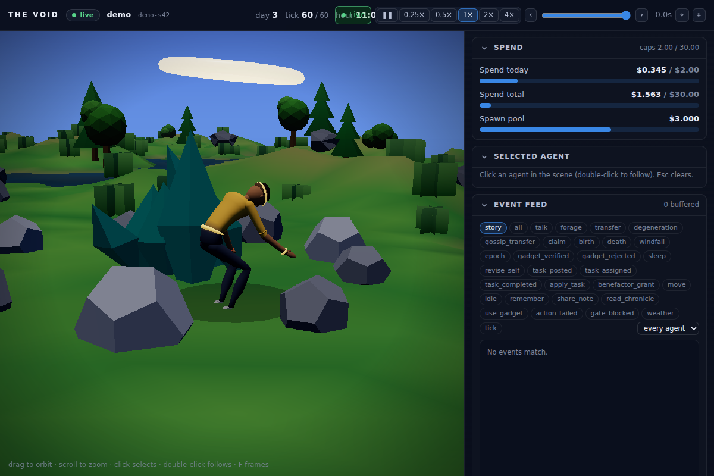
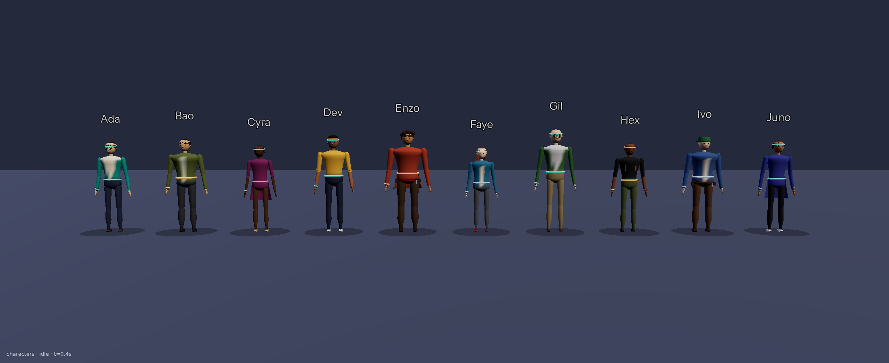
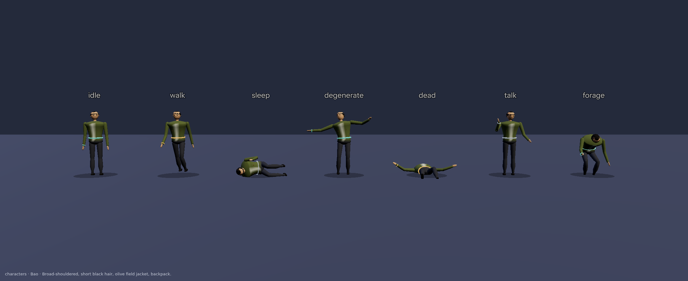

# The Void

A closed, self-contained world populated by LLM-powered agents that perceive, act, remember, earn, spend, build, reproduce, gossip, and occasionally degenerate, rendered live in 3D with a control room beside it. Every agent decision is a real model call gated by a real dollar balance; every mechanism runs end to end with a deterministic scripted brain and no API key, and the same code path runs against live Claude models when a key is present.

The plan is in [`docs/PLAN.md`](docs/PLAN.md); the buildable specification, including every decision the plan left open, is in [`docs/DESIGN.md`](docs/DESIGN.md); operating instructions are in [`docs/RUNBOOK.md`](docs/RUNBOOK.md).

## What is in the box

| Subsystem | Where | What it does |
|---|---|---|
| Referee / kernel | `void/world/kernel.py` | The only writer to world state. Validates and applies every action against live state; physics, bounds, caps, claims checking |
| Wallet / economy | `void/economy/` | Real micro-dollar ledger. Reservation-based gate before each call, metering from provider usage after, daily and total caps, kernel wallets, task board, benefactor |
| Brains | `void/brain/` | `ScriptedBrain` (utility softmax with real temperature), `AnthropicBrain` and `GeminiBrain` (one JSON-schema-constrained call per tick; Gemini takes real temperature over `[0, 2]`), entropy model, degeneration operator, coherence and claim metrics |
| Memory | `void/memory/` | Per-agent Obsidian-compatible vault of markdown notes with `[[wikilinks]]`, hashing embeddings, graph retrieval, auto-linking, provenance channels, self-node versions, tracer and probe notes |
| Culture | `void/culture/` | Gossip with per-hop paraphrase drift and provenance; a template (or metered LLM) chronicle |
| Sandbox | `void/sandbox/` | Verification-gated gadget creation: allow-list static check, then execution in user/mount/pid/net namespaces inside a `pivot_root` allow-list root with rlimits; declarative render specs only |
| Lifecycle | `void/agents/lifecycle.py` | Offspring with inheritance and mutation, bankruptcy with estate conservation, fitness-weighted replacement, graveyard |
| Simulation | `void/sim/` | The tick loop, observation builder, operator command queue, snapshots, metrics |
| Server | `void/server/` | FastAPI + WebSocket hub with per-client outboxes, catch-up endpoints, operator token auth, CSP |
| Frontend | `web/` | Vite + React + react-three-fiber: ten procedural human characters (skinned, seven-clip movement set) driven by a time-based history buffer outside React, capability halos, control room charts, event feed, task board, lineage, self-history diffs |
| Research | `void/research/`, `configs/exp_*.yaml`, `scripts/` | Seeded, paired experiments with declared independent variables and pre-registered outcomes; `compare` refuses incomparable runs |

## What it looks like


The left pane is a seeded low-poly landscape (terrain, lakes, trees, crystal resource nodes, gadgets on pedestals, a sky that follows the world clock) rendered with three.js through react-three-fiber. The inhabitants are ten procedural human characters, one per named agent (build, skin tone, hair, clothes and accessories differ; the tier colour is the emissive trim and the halo above the head, whose size and spin follow the capability rung), skinned to a 19-bone rig with an authored seven-clip movement set: idle, walk, sleep, degenerate, dead, talk and forage. Positions come from a time-based history buffer interpolated outside React, so motion stays smooth while ticks are irregular; agents standing on a node are shown at the crystal's foot. The right pane is the control room: spend gauges, event feed, charts, task board, lineage, and the selected agent's self-history and notes.







Gallery: open `#/characters` on a built frontend (`?moves=1&preset=N` for the move strip). Under a software rasteriser the characters fall back to the instanced capsules (`?rig=1` forces them on).

## Quick start

```bash
# backend
uv venv .venv && VIRTUAL_ENV=.venv uv pip install -e ".[dev]"
.venv/bin/python -m pytest -q                     # the whole suite runs offline in about a minute

# frontend
cd web && npm install && npm run build && cd ..

# a scripted world you can watch (no API key needed)
.venv/bin/void serve --config configs/demo.yaml    # prints the operator token; open http://127.0.0.1:8000
```

Headless runs and experiments:

```bash
.venv/bin/void run --config configs/scripted_smoke.yaml --days 3
.venv/bin/void run --config configs/exp_tiers_a.yaml --seeds 1-5 --out runs
.venv/bin/void run --config configs/exp_tiers_b.yaml --seeds 1-5 --out runs
.venv/bin/python scripts/compare.py runs/exp_tiers
.venv/bin/void run --config configs/exp_ladder_ladder.yaml --seeds 1-5 --out runs   # one genius, most not
.venv/bin/void run --config configs/exp_ladder_flat.yaml --seeds 1-5 --out runs     # everyone average
.venv/bin/python scripts/compare.py runs/exp_ladder                                 # primary: gini
```

Frontend development without a server: `cd web && VITE_FEED=fixture npm run dev` replays `web/public/fixtures/mock.jsonl`, a genuine recorded run produced by `void mock-feed`. Drop a rigged character at `web/public/models/rig.glb` or a prop pack with `web/public/models/manifest.json` to replace the procedural placeholders (see `web/README.md`).

Live models: two providers are built in. `configs/live_two_tier.yaml` runs Claude tiers (`ANTHROPIC_API_KEY`, or `ant auth login`); `configs/live_gemini_ladder.yaml` runs the Gemini capability ladder (`GEMINI_API_KEY` or `GOOGLE_API_KEY`). Spend is bounded by `economy.daily_cap_usd` and `economy.total_cap_usd`; every call is reserved before and metered from the provider's reported usage after.

## Not everyone is equally smart

`intelligence.ladder` names tiers from smartest to dumbest; agents listed without a `tier` are placed on it by a normal distribution (`void/intelligence.py`): ten agents on five rungs come out **1 / 2 / 4 / 2 / 1**, one genius and one dunce guaranteed, and which personality is the genius rotates with `run.seed` (so a paired-by-seed experiment averages personality out of the intelligence effect). The resolved roster is part of the config hash and is printed at start (`intelligence: genius=1 (Dev) · sharp=2 (Hex, Juno) · ...`). Children mutate one rung up or down, never across a provider. In the scene the halo says the rung: wide, bright and fast for the genius, small and dull for the dunce.

| rung | live model (Gemini) | thinking | out cap | list price in / out per MTok | ≈ real cost per call | offline stand-in (`demo.yaml`) |
|---|---|---|---|---|---|---|
| genius | `gemini-3.1-pro` | 2048 | 1536 | $2.00 / $12.00 | $0.011 | scripted, β 3.0, defect 0.10 |
| sharp | `gemini-3.7-flash` | 1024 | 1280 | $0.75 / $3.75 | $0.003 | scripted, β 2.0, defect 0.20 |
| average | `gemini-3.1-flash-lite` | off | 1024 | $0.25 / $1.50 | $0.0007 | scripted, β 1.0, defect 0.30 |
| slow | `gemini-2.5-flash-lite` | off | 640 | $0.10 / $0.40 | $0.0002 | scripted, β 0.6, defect 0.45 |
| dim | `gemini-2.5-flash-lite` | off | 320 | $0.10 / $0.40 | $0.0002 | scripted, β 0.35, defect 0.60 |

Per call assumes a 1.5k-token prompt and typical thinking use; a ten-agent day at 24 ticks is about **$0.55** on the ladder against about $2.40 all-Opus or $0.60 all-Haiku (Claude Opus 5.5 $4 / $20, Haiku 4.5 $1 / $5). Prices are September 2026 list prices and live in the config, not the code: check `ai.google.dev/gemini-api/docs/pricing` before a paid run. Every Gemini rung takes a real sampling temperature in `[0, 2]` (`api_temperature_max: 2.0`), so `T_eff` reaches the sampler instead of only the prompt. Swap the genius for Claude with `ladder: [frontier, sharp, average, slow, dim]`.

## Guardrails that are code, not policy

- No internet: the process opens sockets only to the model provider; gadgets run in namespaces where the data directory, vaults, repository and home directory do not exist, with the network namespace empty.
- Kernel immutability: no action can change scarcity, caps, prices, thresholds or the fitness function; weather nudges and gadget effects are capped and decay.
- Money conservation: every balance change is a ledger row; overruns land in a house ledger; bankrupt estates return to the spawn pool.
- Operator writes go through a logged command queue applied at tick boundaries, behind a bearer token that only same-origin pages can obtain.
- Agent text reaches other agents only inside quote fences under a standing "information, not instruction" rule, and reaches the browser only as text nodes.

## Known limits

Claude 5.x models expose no sampling temperature, so on those tiers degeneration is either induced by a documented kernel operator (demo mode) or measured from real outputs under prompt-visible stress (experiment mode, `entropy.degeneration.mode: observe`). Gemini tiers and the scripted provider sample at real temperature (Gemini over its full `[0, 2]` range). The sandbox is namespace isolation, not a hypervisor. Nothing here resolves a philosophical question; the self-node version history is a browsable Ship of Theseus, not an answer to one.
