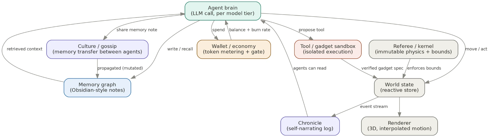
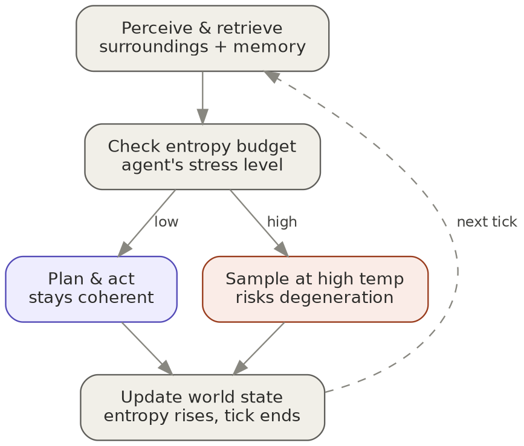
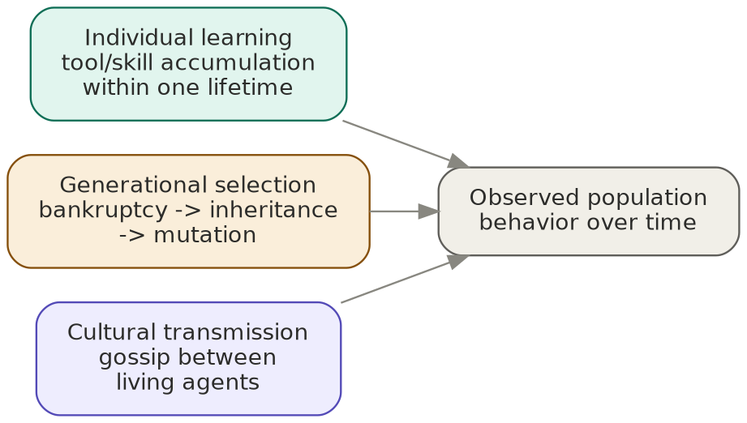

# The Void Project
### An autonomous multi-agent ecology — architecture, research & build plan

---

## 1. Vision

A closed, self-contained world ("the void") populated by a small number of LLM-powered agents that perceive, act, remember, earn, spend, build, reproduce, and occasionally degenerate — all rendered live in 3D. Unlike a scripted game, every agent's behavior is generated at run time by a real model call, gated by a real economic constraint, and shaped by a real, previously-published finding about how language models fail under sampling pressure.

The project sits at the intersection of three things that are usually built separately: a generative-agent social simulation, an open-ended agentic-tools sandbox, and a controlled experiment platform for questions in evolution, memory, and philosophy of mind. The goal is not novelty for its own sake — most of the individual mechanisms below have real prior art, cited throughout — but the specific combination, instrumented well enough to produce actual comparisons rather than just an impressive demo.

## 2. Positioning against prior art

No piece of this is being invented from nothing. Knowing exactly what's already been done is what makes the combination legible as a contribution rather than a rebuild.

| Project | What it demonstrated | What this project adds |
|---|---|---|
| **Generative Agents / "Smallville"** (Stanford, 2023) | Memory-stream + reflection + planning loop produces believable social behavior in 25 agents | Ties agent failure (not just behavior) to a measured, published entropy threshold |
| **AI Town** (a16z-infra) | Deployable, MIT-licensed rebuild of Smallville on a reactive backend (Convex) with smooth-motion interpolation | Reused as the base layer; extended to 3D, mixed model tiers, and an economy |
| **Voyager** (2023) | Lifelong skill-library agent that writes, self-verifies, and accumulates code skills with no human in the loop | Same verification-gate principle, applied inside a sandboxed, non-networked container, paired with population-level selection |
| **Project Sid** (Altera, 2024) | 1,000+ agents in Minecraft spontaneously formed an economy, professions, and a spreading religion (Pastafarianism), with priest agents bribing converts using in-game currency | Direct precedent for the "unexplained benefactor" experiment in §4.8; confirms culture requires social-perception, which this design already routes through the gossip layer |
| **A-MEM, Zep/Graphiti, Mem0-graph** | Graph-structured agent memory (linked notes / temporal knowledge graphs) outperforms pure vector similarity for relational recall | Implemented literally as a folder of markdown notes with wikilinks — inspectable, and directly compatible with actual Obsidian |
| **Vending-Bench Arena / Agent Bazaar** (2026) | Frontier models spontaneously formed price cartels and monopolistic behavior in competitive agent markets; documented failure modes (volatility spirals, Sybil-style deception) | Anticipated directly in the wallet/task-board design via a human approval gate |
| **"SoK: Agentic Skills" / SkillsBench** (2026) | Self-generated agent skills *without* iterative verification underperform skill-free baselines in most configurations | Reason the tool-creation sandbox requires a test-harness gate before any skill enters an agent's registry |

## 3. System architecture



Nine pieces, three of which are load-bearing enough to design first: the **agent brain** (the actual LLM call, parameterized by which model tier this agent runs on), the **wallet**, which gates every one of those calls against a real balance, and the **world state** store, which everything else reads from and writes to. Everything else — memory, sandbox, culture, chronicle, renderer — is a consumer or producer attached to that core loop.

## 4. Core subsystems

### 4.1 World & rendering

The world starts as a literal blank space — no pre-authored tile map — and fills in only with what agents build. Rendering runs on a fork of **AI Town** (Convex reactive backend + a game loop already separated from game-specific rules), with the pixel-art layer (`pixi-react`) swapped for **react-three-fiber** + **drei** for full 3D. Characters use **ReadyPlayerMe** for rigged avatars and **Mixamo** for animation clips — assembled, not hand-modeled. Color encodes model tier; a subtle pulse encodes current entropy.

The hard problem this reuses rather than re-solves: agent ticks are slow and irregular (LLM latency), but motion needs to look continuous. AI Town's own fix — write state to a history buffer and interpolate/replay it forward on the client (their `useHistoricalValue` hook) — is the answer, extended to also crossfade animation state (`AnimationMixer`) so idle → walk doesn't snap.

A separate **control-room dashboard** (wealth distribution, degeneration events per generation, entropy histograms) sits alongside the 3D view — aimed specifically at viewers who'll recognize the entropy chart as the EIML3 finding, not just ambient flavor.

### 4.2 Agent tick loop & entropy-driven degeneration



Each tick: perceive the world and retrieve relevant memory, check the agent's current entropy budget, then either act coherently or — if the budget is spent — sample at elevated temperature, which risks the same kind of degeneration characterized in the EIML3 paper (architecture-dependent collapse: dense models around T≈1.78–1.84, one MoE model earlier around T≈1.52–1.61).

Agents run on **mixed model tiers** — some on a frontier-class model, some on a smaller/older one — as a deliberate independent variable. Important distinction to hold onto: capability tier and entropy/degeneration robustness are **not the same axis**. They may correlate; that correlation (or its absence) is one of the actual findings this system can produce, not an assumption to build in.

### 4.3 Memory

Each agent's memory is a folder of markdown notes with `[[wikilinks]]` — an actual Obsidian-compatible vault, not a vector store. New notes attach to related existing ones (A-MEM's approach), and retrieval is graph traversal (follow links N hops) plus lightweight embedding search to find the entry point — the hybrid most current literature on this recommends over either approach alone.

Memory-writing is a deliberate tool call (`remember(note, links_to)`), not automatic logging — the agent chooses what's worth keeping. One distinguished node, `self`, is always injected into context and revised through its own dedicated tool (`revise_self(new_summary)`, length-capped to a few sentences) rather than the general memory tool — giving a clean, versioned history of how the agent's self-narrative drifts over time.

### 4.4 Economy

Every LLM call is metered against a real wallet balance and blocked if it can't be covered — the fictional "no money, they die" rule and the actual real-dollar safety cutoff are the same mechanism, not two systems. Cost is charged from **metered actual usage after each call**, never a pre-quoted estimate — token consumption isn't reliably predictable in advance, even by the agents themselves.

Agents run on a **daily active window**, not continuously. They can voluntarily end their day early via a `sleep` tool if there's nothing worth spending on — a one-way decision for that day, forcing real judgment rather than a reversible toggle. A **global daily spend cap** sits above individual balances; whether that's enforced as a synchronized mass-sleep or first-come-first-served (which turns "wake up fast" into its own competitive advantage) is a deliberate design choice, not a detail to leave implicit.

A Craigslist-style **task board**: tasks are posted and applications approved by a human for v1 — no automated judge needed, since a human reviewer already breaks most of the Sybil/collusion failure modes documented in Agent Bazaar. Writing a pitch costs the agent a small amount of its own balance — a costly signal against blanket spam-applying, not a moderation system.

**No internet access**, deliberately. Keeps the world self-contained and avoids exposing agents to arbitrary, untrusted web content — a real risk, not a hypothetical one (see §6).

### 4.5 Tool / gadget sandbox

Agents can request new tools ("gadgets"), gated the way Voyager gates skills: proposed only when existing tools fail at something, executed against a test harness, and only added to the registry if verified. Without this gate, self-generated skills measurably underperform (SkillsBench).

Execution is fully isolated — containers with hard resource ceilings (ideally gVisor/Firecracker-grade), no network egress, ephemeral filesystem, wall-clock/CPU/memory limits enforced by the orchestrator rather than requested by the code, and a population-level circuit breaker on total spend or compute.

Critically: a gadget's *logic* runs in that sandbox; what reaches the renderer is a small **declarative spec** (shape, color, a few parameters) that an existing render type draws — never agent-authored code executed in a viewer's browser. That boundary is the same one that prevents a tool sandbox from becoming an XSS vector the day anyone but the builder loads the page.

Shared, world-level mutable state (weather, and anything like it) is bounded and rate-limited — an agent can *nudge* it within a capped range that decays back to baseline, enforced by a referee/kernel layer agents cannot touch. Without that boundary, "change the environment" collapses into "delete your own scarcity and trivially win."

### 4.6 Reproduction & generational selection

Voluntary reproduction sits alongside bankruptcy-driven replacement as a second path to population turnover. What "inherit" means is the actual design decision: money-only inheritance is closer to franchising than evolution — for this to connect to selection at all, an offspring needs to inherit something about the parent's *strategy* (a personality seed derived from the parent's `self` node, possibly model tier, possibly a handful of high-value memory notes).

```
agents (
  agent_id         TEXT PRIMARY KEY,
  parent_id        TEXT REFERENCES agents(agent_id),
  model_tier       TEXT,
  balance          REAL,
  personality_seed TEXT,
  memory_path      TEXT,
  generation       INTEGER,
  status           TEXT,      -- alive / bankrupt / archived
  created_at       TIMESTAMP
)
```

Implemented as a single, structured, orchestrator-validated call (`create_offspring(...)`) executed as one atomic transaction — never raw agent-emitted SQL, for the same reason the tool sandbox doesn't execute raw agent-emitted code. A minimum-reserve requirement before reproduction is allowed decides, on purpose, whether a near-bankrupt agent can flee into a successor rather than actually failing. Total population needs a hard ceiling — reproduction without one means unbounded, unbudgeted growth in concurrent LLM calls.

### 4.7 Culture

When two agents communicate, a memory note can copy across, LLM-paraphrased slightly each hop — rumors, grudges, and beliefs propagating and mutating like an actual game of telephone, on the same wikilink infrastructure built for individual memory. Every transplanted note carries provenance (source agent, hop count, generation) — without it, "culture drifting through mutation" and "coincidence" are indistinguishable in the logs.

A **chronicle** — a separate process that reads the raw event log and writes it up on a cadence, town-crier or newspaper style — gives a second, faster, more faithful information channel agents can read alongside slow, mutating gossip. That contrast (does information spread differently through "press" than through word of mouth) is a real, testable question sitting for free inside two pieces of infrastructure that were each needed anyway.

A **graveyard**: archived (never deleted) memory graphs for bankrupt/replaced agents, linked from their offspring's record via `parent_id` — a browsable family tree rather than a separate system.

**Epochs**: manual, privileged pulls on the same bounded weather/scarcity lever agents already have limited access to — a scarcity event, a sudden arrival, an extreme-weather week — giving the sim narrative arcs on a schedule rather than pure ambient drift.

### 4.8 The "unexplained benefactor" experiment

The specific curiosity that motivated this section: if an external, opaque, powerful entity periodically grants extra resources, do agents form something recognizable as belief or ritual around it?

Project Sid already answered a version of this at scale — priests spreading Pastafarianism, bribing converts with in-game currency, entirely unprompted. The design question is how to test for the real thing rather than a staged performance:

- **Cheap talk vs. costly signal.** Telling an agent "I am god, here's $50" and getting a grateful, worshipful reply proves nothing — that's just the highest-probability completion of a prompt you wrote. The real signature is whether belief *persists* without re-prompting, *spreads* to agents who never got a direct message, and produces *costly* behavior (spending real balance to build a shrine gadget, or bribing others the way Project Sid's priests did) rather than only words.
- **Opacity raises the odds; transparency kills them.** A stated, legible reward formula gets modeled mechanically. An unexplained, semi-arbitrary "why me and not them" is what pushes toward mythologizing instead — consistent with both the training data these models draw on and Project Sid's own conditions.
- **The sharper version of the experiment**: don't announce "I am god" at all. Grant unexplained resources from an unnamed source, on no visible schedule, and see what the population invents to explain it — that's the actual Pastafarianism result, arrived at with zero prompting toward religion, and it's a straightforward re-run of Project Sid on this project's own architecture (with model-tier and entropy as added variables nobody has tested yet).

## 5. The three channels of change



Two of these are usually studied in different fields entirely. Having all three running in one, comparably instrumented system is what turns "cool simulation" into an actual comparative-evolution testbed:

- **Individual learning** — Voyager-style skill accumulation within one agent's lifetime.
- **Generational selection** — bankruptcy as a fitness signal, inheritance and mutation on reproduction.
- **Cultural transmission** — gossip-propagated beliefs and strategies between living agents, no reproduction required.

## 6. Safety & engineering guardrails

These aren't hedges bolted on for appearances — several of them are the actual mechanism that makes the fictional rules work, not a separate layer:

- **No internet access, by default.** The void stays genuinely closed; nothing an agent "knows" wasn't built or given inside the world. Reopening this later (e.g. a real external task board) is a different project with a different risk profile — real clients, real liability, and, demonstrably, real content crafted specifically to manipulate autonomous readers.
- **Sandbox isolation is non-negotiable**: container-level resource limits at minimum, no network egress, ephemeral filesystem, orchestrator-enforced (not code-requested) ceilings, and a circuit breaker on total spend or compute.
- **Declarative rendering only.** Agent-authored logic never becomes agent-authored code executed in a viewer's browser.
- **The referee/kernel layer is immutable by agents.** Physics, scarcity rate, and the fitness function itself sit outside what any agent — no matter how wealthy or clever — can rewrite.
- **Reproduction and gadget creation go through orchestrator-validated, atomic, typed calls** — never raw agent-emitted SQL or code.
- **Population and spend both need hard ceilings**, independent of each other.

## 7. Build sequencing

1. **Renderer against mock data** — R3F/drei, primitive shapes, correct interpolation — before any agent or LLM call exists.
2. **Minimal tick loop** — 4–6 agents, two model tiers, the entropy branch, world state flowing live into the renderer.
3. **Memory** — graph-based, `remember()` and `revise_self()` tools.
4. **Economy** — wallet, metering/gating, sleep/wake, daily cap.
5. **Sandbox tools** — verification-gated gadget creation, declarative rendering.
6. **Reproduction & culture** — inheritance schema, gossip propagation with provenance, chronicle, graveyard.
7. **Everything else** — epochs, control-room dashboard, character art pass (ReadyPlayerMe/Mixamo swapped in only after primitives prove the loop works).

## 8. Research agenda

Each needs paired runs (with/without the mechanism; tier A vs. tier B) and the same seeded, versioned-config discipline as the EIML3 work — that discipline is what turns a run into an experiment.

1. Does model capability tier predict entropy/degeneration robustness, or are they independent axes?
2. Does economic scarcity measurably increase deceptive or degraded output, and does that interact with capability tier?
3. Does graph-based memory produce different downstream behavior than vector-only memory, controlling for population and tasks?
4. Does removing the tool-verification gate degrade performance over generations — a population-scale replication of the SkillsBench finding?
5. Does a good strategy spread faster through inheritance (vertical) or gossip (horizontal), and under what conditions does culture outrun biology or the reverse?

## 9. Open-source extraction candidates

Ranked by likely outside adoption, not by how central they are to the sim itself:

1. **Wallet / token-metering-and-gating layer** — highest real-world pull; anyone running autonomous agents in production has this exact problem.
2. **Graph/Obsidian-style memory package** — timely; ships into an active, current debate rather than a settled one.
3. **Entropy-aware sampling / degeneration guard** — directly extends EIML3; resolve overlap with the existing abstention-guard-skill project explicitly before building it twice.
4. **Tool-creation verification harness** — useful, but the most crowded of these (Voyager, A-MEM, and others already occupy this space) — needs a sharper hook to stand alone.
5. **Sleep/wake population scheduler** — lowest standalone value; likely just internal game logic.

## 10. Philosophy angle (essay material, not research claims)

A simulation can dramatize a philosophical puzzle vividly. It cannot resolve one — worth holding that line explicitly rather than overselling it later.

- **Personal identity.** A self-revising memory node with a full version history is a live, inspectable Ship of Theseus: at what point, if ever, is a repeatedly-rewritten agent "the same agent"? Great essay material; not something the simulation "answers."
- **Determinism and "choice."** Since decisions trace directly to sampling randomness plus context, temperature is almost literally a dial labeled "less determined, more free" — except the entropy research says past a threshold, that isn't freedom, it's degeneration. Worth writing as an argument, not as a finding.

## 11. Explicitly out of scope (for now)

- **Donations / monetization.** Dropped — real precedent exists (VTuber-style support-the-creator framing is legally settled; anything with a payout contingent on agent performance drifts toward gambling-law territory) but not worth architecting around before anything is running.
- **Real external task boards / internet access.** A live job-marketplace integration (evaluated and declined for now) is a fundamentally different project — real companies, real deliverables, real liability — and, if revisited, needs a mediation layer that treats all external content as data, never as instructions.

## 12. References

- Generative Agents ("Smallville"), Stanford — https://github.com/joonspk-research/generative_agents
- AI Town, a16z-infra — https://github.com/a16z-infra/ai-town
- AI Town architecture notes — https://github.com/a16z-infra/ai-town/blob/main/ARCHITECTURE.md
- Claude-ported Smallville fork — https://github.com/AlexHarn/claudeville
- Voyager: An Open-Ended Embodied Agent with Large Language Models — https://arxiv.org/abs/2305.16291 / https://voyager.minedojo.org/
- Project Sid: Many-agent simulations toward AI civilization — https://arxiv.org/abs/2411.00114 / https://github.com/altera-al/project-sid
- MIT Technology Review on Project Sid — https://www.technologyreview.com/2024/11/27/1107377/a-minecraft-town-of-ai-characters-made-friends-invented-jobs-and-spread-religion/
- Mem0 graph memory — https://mem0.ai/blog/graph-memory-solutions-ai-agents
- "Memory in the Age of AI Agents" (survey, covers A-MEM, Zep, GraphRAG) — https://arxiv.org/pdf/2512.13564
- "Memory is Reconstructed, Not Retrieved: Graph Memory for LLM Agents" (A-MEM comparison) — https://arxiv.org/pdf/2606.06036
- Vector Databases vs. Graph RAG for Agent Memory — https://machinelearningmastery.com/vector-databases-vs-graph-rag-for-agent-memory-when-to-use-which/
- "SoK: Agentic Skills" (SkillsBench finding on unverified self-generated skills) — https://arxiv.org/pdf/2602.20867
- Bilevel Optimization of Agent Skills (Voyager, SAGE lineage) — https://arxiv.org/pdf/2604.15709
- Agent Bazaar: Enabling Economic Alignment in Multi-Agent Marketplaces — https://arxiv.org/pdf/2605.17698
- Token Economics for LLM Agents — https://arxiv.org/pdf/2605.09104
- Strategic Exploitation in LLM Agent Markets ("TruthMarket") — https://arxiv.org/pdf/2605.10059
- Microsoft Research — How Do AI Agents Spend Your Money? — https://www.microsoft.com/en-us/research/publication/how-do-ai-agents-spend-your-money-analyzing-and-predicting-token-consumption-in-agentic-coding-tasks/
- react-three-fiber — https://github.com/pmndrs/react-three-fiber
- drei — https://github.com/pmndrs/drei
- pixi-react (used by AI Town) — https://github.com/pixijs/pixi-react
- ReadyPlayerMe — https://readyplayer.me/
- Mixamo — https://www.mixamo.com/
