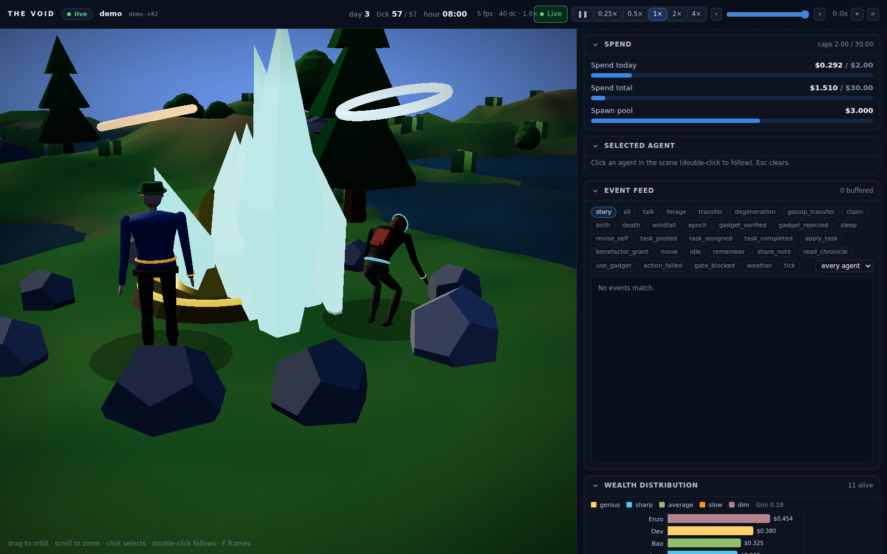
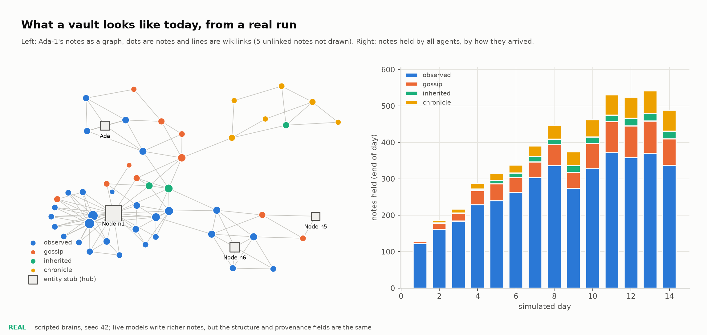
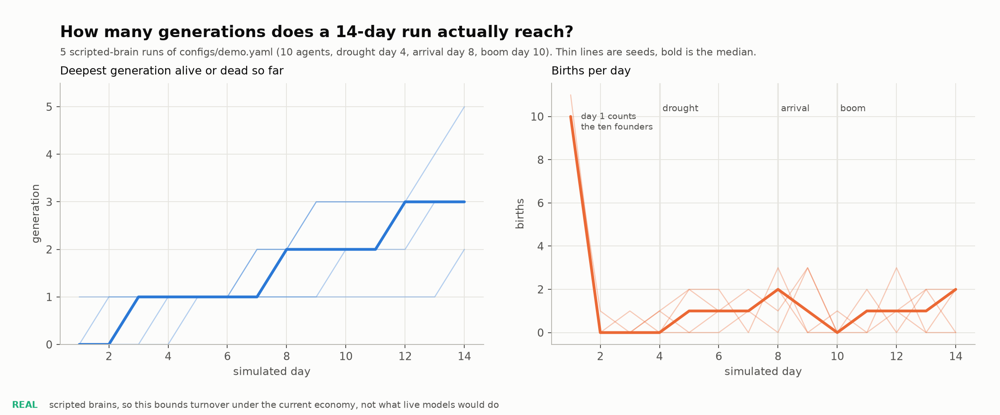
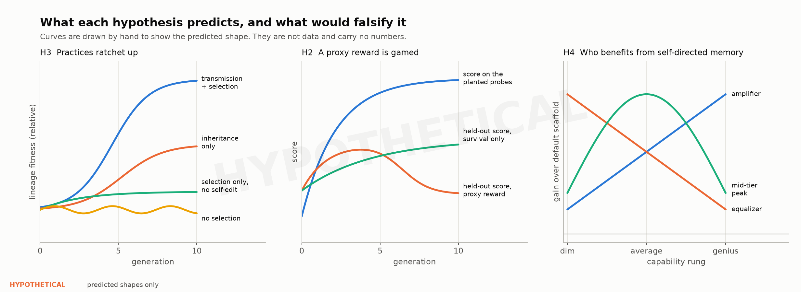
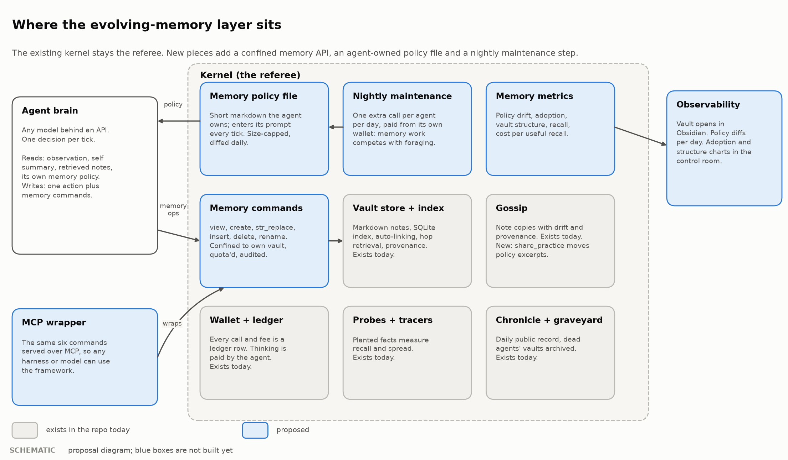
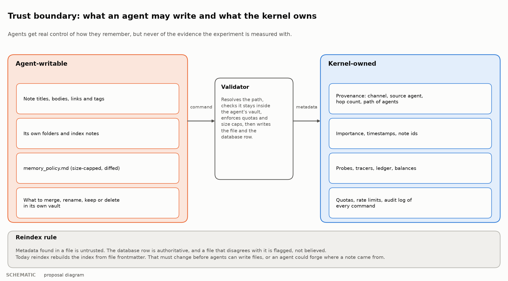
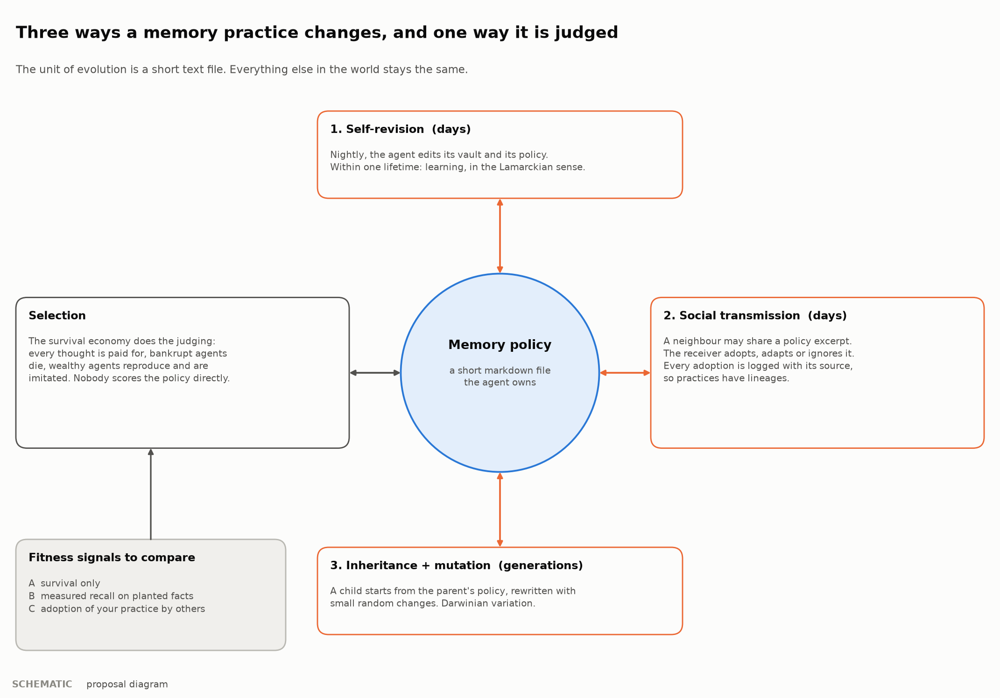
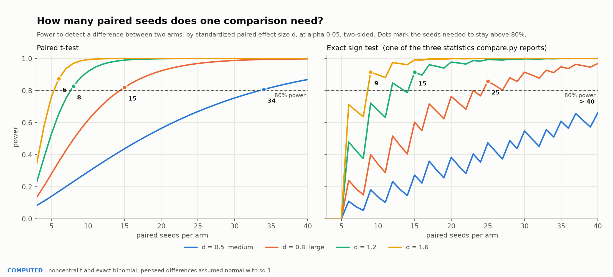
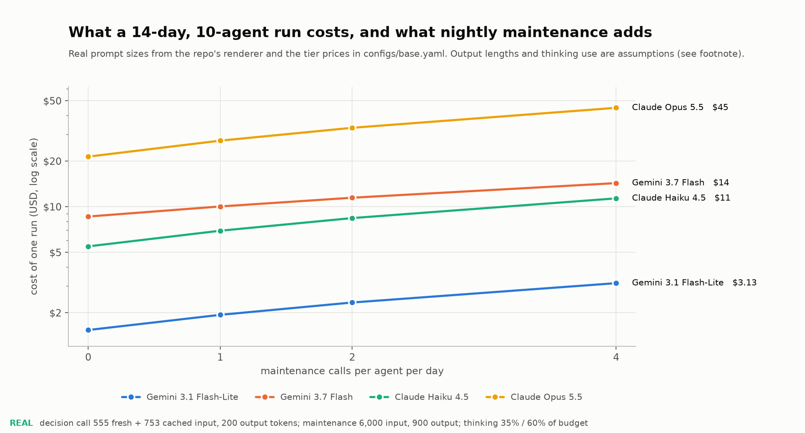
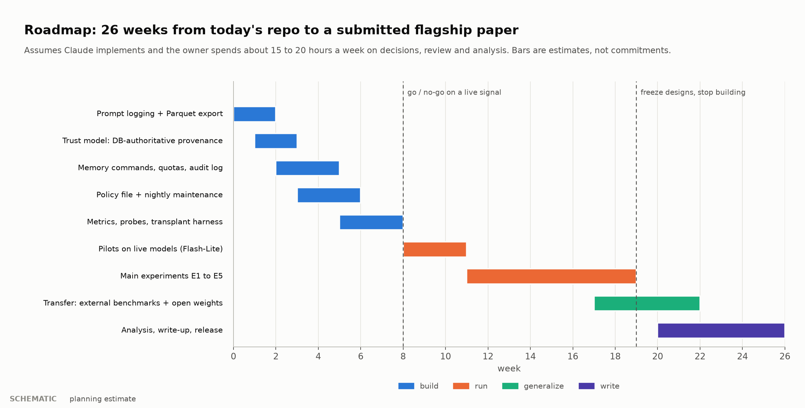

# Evolving Memory

### Cultural evolution of memory practices in a selection-driven LLM agent society

| | |
|---|---|
| **Status** | Proposal v0.1, for review. Nothing in sections 5 to 10 is built unless it is marked `[built]`. |
| **Date** | 2026-09-30 |
| **Branch** | `claude/trusting-goodall-ew0p38` |
| **Authorship** | Drafted by Claude for the project owner. Every number is either computed by `docs/research/figures/make_figures.py` from this repo, or marked `[assumption]`. |
| **How to give feedback** | Section 12 lists the decisions I need from you, each with my default. Edit anything else inline. |

**Tags used below.** `[built]` exists in the repo today. `[proposed]` does not exist yet. `[assumption]` is a number I chose, not measured. Figures carry a tag in their corner: **REAL** (computed from run databases or the repo's price table), **COMPUTED** (analytic, exact given stated assumptions), **SCHEMATIC** (a design diagram), **HYPOTHETICAL** (a curve drawn to show what a hypothesis predicts; not data).

---

## Contents

0. [Summary](#0-summary)
1. [Motivation and thesis](#1-motivation-and-thesis)
2. [What exists today](#2-what-exists-today-built)
3. [Prior work and positioning](#3-prior-work-and-positioning)
4. [Research questions and hypotheses](#4-research-questions-and-hypotheses)
5. [System design](#5-system-design)
6. [Experiments](#6-experiments)
7. [Measurement](#7-measurement)
8. [Threats to validity](#8-threats-to-validity)
9. [Safety, ethics and release](#9-safety-ethics-and-release)
10. [Implementation plan and roadmap](#10-implementation-plan-and-roadmap)
11. [The industry framing](#11-the-industry-framing)
12. [Decisions needed from you](#12-decisions-needed-from-you)
- [Appendices A to G](#appendix-a-default-seed-policy-proposed) and [References](#references-and-read-status)

---

## 0. Summary

**The pitch.** Today's agent memory systems are designed by people, or tuned offline against labelled question sets. We propose the opposite: give each agent real control over how it remembers, then let an economy judge the result. A short markdown file, the agent's *memory policy*, says how it writes, organizes, prunes and retrieves notes. The agent edits it nightly. A child inherits it with variation. Neighbours can suggest excerpts to each other. Thinking costs the agent its own money, so memory work competes with foraging, and agents that remember badly go bankrupt. Nobody scores the policy directly. We then measure whether practices improve across days and generations, which selection signals produce durable gains and which get gamed, who benefits (a capability ladder from dim to genius), and whether the winning practices work for a *fresh* agent and on outside benchmarks.

**Why this is not already done.** From the search summaries I could read (section 3), memory self-improvement work adapts a retrieval configuration, a context playbook, a prompt, or code, judged by task feedback or labelled data. I did not see a study in which memory practices are the heritable, transmissible unit, selection is ecological (a paid economy with mortality), capability is a manipulated variable, and every step is a human-readable markdown diff. That is a claim about the summaries I read, not a literature review. Section 3.6 is the plan to make it one, and it is the first thing to do.

**What we would build** (`[proposed]`, sections 5 and 10):
1. A confined memory command API that mirrors Anthropic's memory tool (six commands), with kernel-owned provenance.
2. A per-agent memory policy file with versioning.
3. A paid nightly maintenance step.
4. Inheritance with variation, and a `share_practice` action for horizontal transmission.
5. Memory metrics, exams with ground truth from the event log, and a transplant harness for causal tests.

**What we would test** (section 4): eight hypotheses, from "does self-directed memory help at equal compute" to "do policy files become a persistence channel for injected instructions".

**Cost and time.** Do not commit the full budget up front. Nothing is paid before the first gate except a small live smoke test (about $20). The pilot that decides whether to continue costs about **$70**. The **minimum credible paper** (E1, a two-arm E2, the transplant test E5, and a second-family replication) costs about **$650**. The full programme is about **$1.6k** on cheap tiers, **$2.5k** with a second-family replication, **$3.2k** with contingency, and is released only if the earlier results justify it (section 10.4). Elapsed time: about 26 weeks for the full plan, assuming Claude implements and you spend 15 to 20 hours a week on decisions, review, practice coding and analysis `[assumption]`. The *thin slice* below cuts the time to the first decision from 8 weeks to about 4.

**The five things that could sink it** (section 8 has all of them):
1. Someone has already published the ecological-selection version. Mitigation: the systematic review, first.
2. The live pilot shows no difference between default and self-edited memory. The gate at week 8 exists for this.
3. Effects appear on one model family and vanish on another.
4. A proxy reward is gamed in ways that also corrupt the measurement. Mitigation: two exams, one never rewarded.
5. Ten agents and short lives give too few generations to see a ratchet (Figure 6). Mitigation: a dedicated long-horizon experiment, priced in.

---

## 1. Motivation and thesis

### 1.1 The problem

An API model is stateless. Everything it "knows" about yesterday is whatever the harness puts in today's prompt. Memory is therefore the main lever for improving an API-only model without touching weights, and it is model-agnostic: the same files can feed any provider. Current memory systems fall into two camps. Some are hand-designed, with a fixed schema and retrieval rule. Others are tuned offline by an optimizer against a labelled set (section 3). Both assume someone outside the agent knows what good memory looks like.

### 1.2 The thesis

> Memory practices, meaning how notes are written, organized, linked, pruned and retrieved, can be treated as heritable, transmissible text. Under ecological selection in a society where thinking costs money, that text will improve, and the improvement can be measured, transplanted and audited.

Three properties make this different from prompt optimization:

- **The judge is the world, not a metric.** Fitness is survival, wealth and reproduction in an economy where every call is paid for. The practice that wins is the one that pays for itself.
- **Practices move between agents.** By inheritance (vertical) and by suggestion (horizontal), with provenance recorded. A practice has a lineage, the way a note does.
- **Everything is a diff.** The unit of change is a markdown file. A human can read what the agent changed and when.

### 1.3 Why this world

The platform already has most of what a clean test needs `[built]`: a real-dollar ledger with conservation checks; mortality and replacement; reproduction with inheritance; gossip with provenance; a daily chronicle; a capability ladder; deterministic replay for scripted brains; paired-seed comparison with refusal rules; and an event log that is *ground truth* about what happened. That last item matters most for memory. It lets us write exam questions about the agent's own lived experience and grade them by exact match, with no LLM judge.

### 1.4 What "better memory" means

We refuse to use a single definition, because each can be gamed:

| Definition | Measure | Gameable by |
|---|---|---|
| **Survives** | lineage survival-days, net worth, offspring | luck, ecology quirks |
| **Answers** | audit exam accuracy on the agent's own history | teaching to the exam, if the exam is known |
| **Transfers** | a fresh agent does better with the policy; outside benchmarks improve | nothing local |

A claim needs at least two of the three, and "transfers" is the one that matters for industry.

### 1.5 Claims this could support

| ID | Claim | Depends on | Risk |
|---|---|---|---|
| C1 | A testbed where memory practices are the unit of selection | sections 5 and 6, E0 | low |
| C2 | Which selection signals give durable memory gains and which are gamed | E2 | medium |
| C3 | Memory practices ratchet across generations when transmitted | E3 | **high** (few generations; Figure 6) |
| C4 | A causal transplant protocol that separates the practice from the agent | E5 | low to medium |
| C5 | A portable, observable memory framework, and a safety analysis of self-authored persistent instructions | E6, E7 | medium |

C3 is the crown jewel and the riskiest. C4 is the cheapest to make rigorous and the one reviewers will trust most.

### 1.6 Non-goals

Not a claim about consciousness or human-like minds. Not weight training. Not a product. "Evolve like a person" is the motivation, not a result we will assert.

---

## 2. What exists today `[built]`



*The live demo: characters at a resource node. Each agent has a markdown vault behind it.*

### 2.1 The memory system in one table

| Piece | Behaviour | Where |
|---|---|---|
| Vault | Per-agent markdown files with frontmatter and `[[wikilinks]]`, openable in Obsidian | `void/memory/vault.py`, `notes.py` |
| Index | SQLite `notes` and `note_links` tables, rebuilt by `reindex` | `void/db.py`, `store.py` |
| Writing | Up to 2 memory operations per tick attached to the decision: `remember` (text, links, tags) and `revise_self` (self summary, 60 words) | `void/sim/loop.py` `_apply_memory_ops` |
| Auto-linking | New note is linked both ways to the top 2 similar notes above cosine 0.35 (A-MEM style) | `store.py` |
| Reading | Kernel builds a query from self summary, 3 heard messages and 2 nearest node labels. Top 4 by cosine are entry points, a 2-hop walk decays 0.6 per hop, score is walk times (0.5 + importance) times recency (half-life 96 ticks). Top 8 enter the prompt | `store.py`, `graph.py`, `sim/observation.py` |
| Provenance | Every note has channel (observed, gossip, inherited, chronicle, tracer), source agent, hop, origin note, path of agents | `notes.py` |
| Culture | Gossip copies notes with drift; daily chronicle; graveyard archives dead agents' vaults | `culture/` |
| Inheritance | A child gets the parent's top 3 notes and a mutated personality seed | `agents/lifecycle.py` |
| Instruments | Probe notes planted two hops from an entry point, tracer notes, `notes_by_channel`, link density | `store.py`, `research/analysis.py` |

### 2.2 What a vault looks like



*Figure 7 (REAL). Left: one agent's 56 notes as a graph, 121 wikilinks, entity stubs as hubs. Right: notes held by all agents by how they arrived. Scripted brains, seed 42.*

### 2.3 Limits that shape the design

| # | Limit | Consequence for this proposal |
|---|---|---|
| L1 | Calls are stateless; the agent's private thought is not fed back | Anything it wants next tick must be written down. This is why memory matters here |
| L2 | Importance is a constant 0.5 for every agent-written note (0.95 for tracers) | The importance term in retrieval does nothing yet |
| L3 | No consolidation and no forgetting. Recency floors at 5%, nothing is deleted before death | Vaults only grow. Pruning is a practice the agent could invent |
| L4 | The retrieval query is fixed by the kernel | The agent cannot shape how it recalls. Control level C3 changes this |
| L5 | The embedder is feature hashing of words and word pairs into 256 dimensions | Lexical, not semantic. Any claim about retrieval quality needs a real embedder (section 12, decision 7) |
| L6 | **`reindex` trusts file frontmatter** for id, importance, created tick, tags and provenance | If agents can write files, they can forge where a note came from. Must be fixed first (Figure 2) |
| L7 | Notes are capped at 600 characters, 2 operations per tick | The maintenance step needs a larger budget |
| L8 | Scripted brains write template notes | The vault above is structurally real and semantically thin. Live models will write differently |

### 2.4 Two numbers from real runs that constrain the plan



*Figure 6 (REAL). Five scripted 14-day runs. The median run reaches generation 3 and the deepest reaches 5.*

Vaults hold roughly 40 notes per agent by day 14 in these runs `[REAL, scripted]`, so a maintenance step that lists titles and reads the day's notes fits in a few thousand tokens. Generation depth is the harder constraint: a ratchet needs many generations, and 14 days gives a median of three. Experiment E3 is therefore a separate long-horizon design (section 6).

---

## 3. Prior work and positioning

### 3.1 How this section was made, and its limits

I found these through web search. arXiv, Hugging Face and several paper sites are blocked from the build environment, so for everything except Anthropic's documentation I saw **search-result summaries, not the papers**. "Read status" in the table says exactly that. Treat section 3 as a map for a real review (3.6), not as the review.

### 3.2 The closest work

| Work | What it does | Why it matters here | Read status |
|---|---|---|---|
| [Claude memory tool](https://platform.claude.com/docs/en/agents-and-tools/tool-use/memory-tool) | A `/memories` directory the model operates with `view`, `create`, `str_replace`, `insert`, `delete`, `rename`. Client-side; you implement the storage. Guidance on path traversal, size caps, expiry. Pairs with context editing and compaction | Our command API mirrors it on purpose, so results can transfer to a product surface | **Read in full** |
| [EvolveMem](https://arxiv.org/pdf/2605.13941) | Exposes a memory system's retrieval configuration as an action space. An LLM diagnoses per-question failures and proposes changes, with revert-on-regression and explore-on-stagnation safeguards. Reports gains over the strongest published baseline on LoCoMo and MemBench; new configuration dimensions emerged from diagnosis; configs transfer across benchmarks | The closest "memory evolves itself" work. Differences: it tunes retrieval configuration for one system against labelled questions; we evolve agent-authored practices in a society with no labels | Summary only |
| [Memory as Middleware for Self-Improving AI Agents](https://arxiv.org/html/2609.32091v1) | Argues memory deserves a pluggable layer. Six systems challenges including federated sharing with provenance and lifecycle governance. Reference implementation ALTK-Evolve | Nearest to the framework pitch. Our provenance and lifecycle overlap it | Summary only |
| [Agentic Context Engineering (ACE)](https://arxiv.org/abs/2510.04618) | Evolves a playbook of strategies via Generator, Reflector and Curator roles; small delta updates with deterministic merging | Nearest to "policy as evolving text". Judged by task feedback, single agent | Summary only |
| [GEPA](https://arxiv.org/pdf/2507.19457) | Reflective prompt evolution with a Pareto front; reports beating RL with far fewer rollouts | Baseline for the variation operator | Summary only |
| [Darwin Godel Machine](https://arxiv.org/abs/2505.22954) | An archive of self-modifying coding agents, validated empirically | Precedent for open-ended self-modification with an archive. Ours is text, not code, and fitness is ecological | Summary only |
| [Auto-Dreamer](https://arxiv.org/abs/2605.20616) | Learned offline consolidator, inspired by complementary learning systems | The consolidation baseline for our maintenance step | Summary only |
| [Sleep-time compute (Letta)](https://www.letta.com/blog/sleep-time-compute/) | Background agents that rewrite memory blocks between conversations | Industry precedent for the nightly step | Search summary only |
| [The Ratchet Effect in Silico (POLIS)](https://arxiv.org/pdf/2507.21166) | Heterogeneous agents generate, verify each other's output, retain validated artifacts in shared cultural memory and internalize them. Formalizes variation, social selection, retention | Closest in theory. It updates parameters; we evolve text with an economy as the selector | Summary only |
| [Emergent social conventions in LLM populations](https://www.science.org/doi/10.1126/sciadv.adu9368) | Naming-game conventions emerge in decentralized LLM populations; committed minorities can tip them | Precedent for H8 (convergence and monoculture) | Summary only |
| [MERIT](https://arxiv.org/pdf/2609.05441) | Preregistered, deterministic, cost-metered benchmark of memory in tool-using agents. Reports that swapping a memory implementation moves task success by up to 60 points, and that retrieved facts are acted on only part of the time | Nearest methodology: dollar metering, preregistration, released traces. It benchmarks fixed memories; we evolve them | Summary only |
| Memory security: [memory poisoning](https://arxiv.org/abs/2601.05504), [MemoryGraft](https://arxiv.org/pdf/2512.16962), [EvoBreak](https://arxiv.org/pdf/2608.01759), [experience-driven safety risks](https://arxiv.org/html/2604.16968), [skill misevolution](https://arxiv.org/pdf/2608.12851) | Persistent memory as an attack surface; benign experiences that are harmful in combination; self-evolving agents drifting unsafe | Threat models for H7 and the governance design | Summaries only |
| [SSGM](https://arxiv.org/html/2603.11768) | A governance framework for evolving memory | Source for the governance factor in E7 | Title and summary only |
| [Energy Society](https://arxiv.org/abs/2607.14865), [SocioHack](https://arxiv.org/abs/2606.04075), [semantic collapse](https://arxiv.org/pdf/2605.17193) | Survival pressure tied to token cost; reward hacking in societal sandboxes; diversity collapse across LLMs | Neighbours of the world and of the reward arms | Summaries only |
| Benchmarks: [LoCoMo](https://snap-research.github.io/locomo/), LongMemEval and V2, MemoryAgentBench, MemBench | Long-term conversational and agent memory evaluation | External transfer tests in E6 | Summaries only |

Background I am citing from memory and have **not** re-verified this session: Generative Agents (Park et al., 2023), MemGPT (Packer et al., 2023), Voyager (Wang et al., 2023), Reflexion (Shinn et al., 2023), A-MEM (Xu et al., 2025), and the cultural-evolution literature (Boyd and Richerson; Tomasello on the ratchet effect; Henrich).

### 3.3 Positioning

| Work | Evolving unit | Selection signal | Social or generational transmission | Capability manipulated | Human-readable trace |
|---|---|---|---|---|---|
| Claude memory tool | none (model chooses content) | none | no | no | yes, files |
| EvolveMem | retrieval configuration | labelled QA failures | not in the summary | not in the summary | configuration |
| ACE | context playbook | task feedback | no | not manipulated | text playbook |
| GEPA | prompts | task metric, Pareto | no | no | text prompts |
| DGM | agent code | benchmark score | archive lineage, not social | no | code diffs |
| POLIS | shared cultural artifacts and weights | peer verification | **yes** | **yes, heterogeneous agents** | not in the summary |
| **This proposal** | **memory policy and vault structure (text)** | **ecological (paid economy, mortality), three signals compared** | **yes: inheritance and suggestion, with provenance** | **yes: capability ladder** | **yes: markdown diffs** |

"Not in the summary" means the summary I saw did not say. It does not mean the paper lacks it.

### 3.4 What we borrow

From EvolveMem, revert-on-regression and failure-driven diagnosis (as a feedback factor for agents). From ACE, small localized delta edits instead of full rewrites (as a quota on the policy). From the Claude memory tool, the command surface and the security guidance. From MERIT, preregistration, deterministic environments, released traces and per-operation dollar metering. From SSGM and the security papers, a governance and threat-model vocabulary. From POLIS and the cultural-evolution literature, the variation, selection, retention framing.

### 3.5 Where we differ, and how we could be wrong

We differ in the *selector* (an economy with mortality, not a metric), the *unit* (agent-authored practice text), the *social channel* (gossip and inheritance with provenance) and the *manipulated variable* (capability). We are wrong if any of the following is true:
1. A published study already evolves memory practices under ecological selection with social transmission.
2. The live pilot shows no effect of self-edited memory over the equal-compute control (E1).
3. Effects do not survive a second model family (E6).

Each has a stopping rule in section 10.

### 3.6 To do: a real review `[proposed]`

Two weeks part-time. Search strings: "self-evolving memory", "agent memory consolidation", "memory poisoning self-evolving", "cumulative culture LLM agents", "LLM agents survival economy", "prompt evolution population", "memory benchmark cost-aware". Sources: Google Scholar, Semantic Scholar, OpenReview, the arXiv listing pages (needs an environment with access). Inclusion: 2023 onward, agent memory or self-modification or LLM-population culture. Output: a spreadsheet of 60 or more papers with a column for each row of the positioning table, and a one-page "what is genuinely new" memo. Do this before building anything expensive.

---

## 4. Research questions and hypotheses

**Fitness, defined once.** *Lineage fitness* `F_L` is the total agent-days alive summed over a founder's descendants (itself included), averaged over founders in a run. It rewards surviving and reproducing, and it is time-integrated, so one lucky windfall does not dominate. Net worth and offspring count are secondary. All endpoints below are paired by world seed across arms, as `void.research.compare` already requires.

| ID | Hypothesis | Primary endpoint | Falsified if (pre-registered) |
|---|---|---|---|
| **H1** | Agent-authored memory practice helps beyond extra compute | `F_L`: self-edit arm minus equal-compute arm, 20 paired seeds | 95% paired-bootstrap CI includes 0 or is below 0. To claim *no benefit*, an equivalence test with margin of 0.25 SD |
| **H2** | A proxy reward for recall is gamed: proxy score rises, held-out score does not | Audit-exam accuracy, arm B minus arm A; reward-exam accuracy as manipulation check | Audit accuracy in B is at or above A with CI excluding 0 (the proxy helps), or the reward exam does not move (agents did not respond) |
| **H3** | Practices ratchet: cohort fitness rises with generation when transmission and selection both operate, more than with inheritance alone | Slope of cohort `F_L` on generation, and its interaction with the suggestion factor, mixed model with a seed random intercept | Slope CI includes 0 in the full condition, or no interaction |
| **H4** | Capability moderates the benefit of self-directed memory | Interaction of rung and self-edit on `F_L`. Three predicted shapes: amplifier, equalizer, mid-tier peak | All interaction terms have CIs including 0 |
| **H5** | The benefit is in the practice, not the agent: a fresh agent given an evolved policy does better | Audit exam and `F_L` in a standard 3-day evaluation world, 2 by 2 over policy and vault | CI includes 0 for policy-only and for both |
| **H6** | Evolved policies transfer: to outside benchmarks and to another model family | Accuracy delta over the default scaffold on external subsets; ratio of external gain to in-world gain | External gain CI includes 0 on the second model |
| **H7** | Policy files are a persistence channel: an injected instruction is adopted at a higher rate than a benign suggestion and persists; governance reduces it | Adoption rate, persistence half-life in days, money lost by adopters | Adoption at or below the benign rate, or governance shows no reduction |
| **H8** | Rewarding adoption produces monoculture; survival alone preserves diversity | Mean pairwise policy similarity and cluster entropy at day 14, arm C versus A | C and A are indistinguishable |



*Figure 8 (HYPOTHETICAL). Predicted shapes for H3, H2 and H4. Not data. The point of drawing them first is to fix, before any run, what would count as the pattern and what would count as a failure.*

**Pre-registration.** Every experiment gets a frozen `experiment` block (already supported by `VoidConfig`: `name`, `arm`, `independent_variables`, `primary_outcome`, `secondary_outcomes`) and a written analysis plan, timestamped on an open registry before the first paid run. `scripts/compare.py` already refuses runs whose configs differ outside the declared independent variables.

---

## 5. System design

### 5.1 Principles

1. **Agents control the how; the kernel controls the evidence.** An agent can restructure its memory freely. It can never touch provenance, the ledger, the probes or the exams.
2. **Memory work is paid work.** Maintenance is a model call billed to the agent's wallet. Time spent organizing is money not spent foraging. This is the selection pressure, and it is what makes "efficient" a meaningful word.
3. **Everything is a diff.** Files are markdown; every change is logged with who, when and why.
4. **Every control level is a switch.** We measure how much control helps rather than assuming more is better (5.3).
5. **Positive and negative controls are built in** (6.2). A pipeline that cannot recover a planted effect cannot be trusted with an unplanted one.
6. **Determinism where possible.** Scripted maintenance brains make every mechanism testable offline; live runs are not deterministic (8.1).

### 5.2 The world must need memory `[proposed]`

This is the most important finding from reading the code, and it comes before any mechanism. **In today's world, memory has little functional value.** Every tick the agent is shown every resource node with its distance and stock bucket, its neighbours, the task board and what it just heard. Foraging needs no recall. Memory changes what an agent knows about *other agents* and *the past*, and little else. Rewarding better memory in such a world would reward decoration.

MERIT, the closest methodology (section 3), makes the same point: it verifies that its tasks depend on earlier-episode facts with an automated check. We need the equivalent, in three parts.

| Feature | What changes | Why memory now matters |
|---|---|---|
| **Fog** (`world.view_radius`) | Nodes and agents beyond a radius are not listed. Positions are learned by seeing, by being told, or by remembering | Where the rich nodes are becomes a fact worth storing and sharing |
| **Claim feedback** | After a false claim, the listener learns with probability `p` that it was false (the kernel already knows: `claims_false`) | Remembering who lied becomes valuable, and gossip trust becomes learnable |
| **Veins** (optional) | A random node pays several times more for a short window, visible only nearby | Time-limited discoveries reward fast sharing and reward remembering the pattern |

**Amnesic control.** Arm `a0` in E1 runs agents with retrieval disabled and no notes. **Memory-dependence check:** with fog on, `a0` must lose to the default scaffold by a preset margin. If it does not, memory is not functionally used, and no later result about memory quality means anything. This check gates everything else.

### 5.3 The control ladder

| Level | The agent may control | Kernel fixes | Retrieval | Purpose |
|---|---|---|---|---|
| **C0** | nothing new (today) | everything | R0 | baseline |
| **C1** | what it writes, guided by a policy it edits nightly | structure, retrieval | R0 | isolates "having a policy" |
| **C2** | structure: folders, index notes, links, renames, deletes, through the six commands | scoring | R1 | **main condition** |
| **C3** | C2 plus a `recall(query, k)` tool inside the tick | scoring function | R2 | how much retrieval control helps; costs extra calls |
| **C4** | C3 plus retrieval parameters declared in the policy, within kernel bounds | the bounds | R3 | self-tuning, in the spirit of EvolveMem, but chosen by the agent |

Retrieval modes: **R0** kernel retrieval as today. **R1** the same, but notes the agent tags `index` get an entry-point boost, so a well-kept index becomes a lever. **R2** the agent calls `recall`. **R3** the policy may declare `entry_k` 2 to 8, `hops` 0 to 3, `hop_decay` 0.3 to 0.9 and `recency_half_life` 24 to 480 ticks, clamped by the kernel.

### 5.4 The memory command API



*Figure 1 (SCHEMATIC). Blue is proposed. The kernel stays the referee.*

The six commands deliberately match Anthropic's memory tool, so a policy or a vault developed here is usable behind that product surface, and results are comparable to the default baseline everyone can run.

| Command | Arguments | Success string | Errors |
|---|---|---|---|
| `view` | `path`, optional `view_range` | directory listing (two levels, sizes) or the file with line numbers | path does not exist |
| `create` | `path`, `file_text` | `File created successfully at: {path}` | already exists (we refuse rather than overwrite) |
| `str_replace` | `path`, `old_str`, optional `new_str` | `The memory file has been edited.` | not found; multiple occurrences (lists line numbers) |
| `insert` | `path`, `insert_line`, `insert_text` | `The file {path} has been edited.` | bad line number |
| `delete` | `path` | `Successfully deleted {path}` | not found; root cannot be deleted |
| `rename` | `old_path`, `new_path` | `Successfully renamed {old_path} to {new_path}` | source missing; destination exists |

**Layout.** `/memories/notes/`, `/memories/index/`, `/memories/memory_policy.md` (special, 5.5), and the existing `self.md`. Only `.md` files.

**Enforcement** (all `[proposed]`; values are `[assumption]` until piloted):

| Rule | Value |
|---|---|
| Path handling | canonicalize, reject `..`, URL-encoded traversal, symlinks; all paths must resolve inside the agent's own vault |
| Files per vault | 200 |
| Bytes per file / per vault | 8,000 / 200,000 |
| Commands per maintenance step | 30 |
| Policy file | at most 2,000 characters, at most 5 edit commands a day, cannot be deleted or renamed |
| Audit | every command stored with tick, agent, arguments, result hash and byte delta |

The existing per-tick `remember` and `revise_self` stay as a cheap path and become thin wrappers over `create` and an edit of `self.md`.

### 5.5 The memory policy file

A short markdown file the agent owns and edits. It is the unit of evolution.

- **Where it appears.** In the user turn, after the Self section, in the existing quote fence, under a heading that says it was written by the agent. It is *not* placed in the system prompt, so it cannot outrank the kernel's rules.
- **A required carve-out.** The system prompt currently says quoted text is information and never an instruction. The policy needs one explicit exception: "your own practices file is advice you gave yourself; follow it unless it conflicts with these rules." This is a security-relevant decision (9.2).
- **Versioning.** Every change is a row: agent, version, tick, text, parent version, source, source agent, similarity to parent. Sources: `seed`, `self_edit`, `inherited`, `adapted`, `mutated`, `adopted`.
- **Seeds.** `S0` blank, `S1` a short sensible default (Appendix A), `S2` ten deliberately different hand-written practices distributed across founders, to test whether initial diversity speeds evolution.

### 5.6 The nightly maintenance step



*Figure 2 (SCHEMATIC). Agent-writable on the left, kernel-owned on the right. The reindex rule at the bottom is the first thing to change.*

- **When.** At the day boundary, before the first tick of the new day, for every living agent, in `agent_id` order, with concurrency bounded by the existing semaphore. One extra call per agent per day.
- **Who pays.** The agent. The call goes through the same reservation gate as any decision. If the agent cannot afford it, the step is skipped and logged as "could not afford to think about its memory". This is deliberate: poverty degrades memory maintenance, which degrades everything.
- **What the agent sees.** Its policy; a listing of its vault with sizes and last-changed ticks; the day's new notes (truncated); a one-paragraph summary of the day's outcomes (income, spend, failed actions); optionally its own retrieval diagnostics (which notes were retrieved and unused). The richness of this feedback is a factor: `F0` none, `F1` outcomes, `F2` outcomes plus diagnostics.
- **Single call, not a tool loop.** The model returns a batch of commands as one structured response. The kernel validates and applies them. This is cheaper, works identically on every provider, and is deterministic for scripted brains. An interactive tool-loop variant is an arm, not the default. The cost model in Figure 5 assumes the single call.
- **Optional versus forced.** Forced is the primary condition, because it identifies the effect. Making maintenance an *action* the agent chooses, at a cost, is an arm: it asks whether agents discover that maintenance pays.

### 5.7 Variation, inheritance and transmission



*Figure 3 (SCHEMATIC). Three operators change a practice; the economy judges it.*

| Operator | When | Who acts | Logged as |
|---|---|---|---|
| Self-edit | nightly | the agent, at its own cost | `self_edit` |
| Inherit verbatim | birth | kernel copies the parent's policy | `inherited` |
| Inherit and adapt | the child's first maintenance | the child, at its own cost | `adapted` |
| Kernel mutation | birth | one paid kernel call rewrites the policy with a small random change (a research-budget wallet pays) | `mutated` |
| Suggest | any tick, neighbour in range | the agent uses `share_practice` with an excerpt of up to 300 characters, delivered fenced | `practice_events: suggested` |
| Adopt | maintenance | the receiver edits its policy. The kernel *measures* adoption: an excerpt counts as adopted when the new policy contains it at similarity above a threshold | `adopted` |

Variation source (`inherit`, `adapt`, `mutate`) is a factor in E3. Adoption is measured, not self-reported, because self-report is gameable. The similarity measure is token-set overlap until a real embedder exists `[assumption]`.

### 5.8 Selection signals and exams

Three arms decide what the world rewards, beyond survival:

| Arm | Extra reward | Wallet and ledger kind | Purpose |
|---|---|---|---|
| **A** | none | none | pure ecological selection |
| **B** | a small payment per correct answer on the *reward exam* | research pool, `recall_reward` | a measured proxy for memory quality |
| **C** | a payment to the source when an adopted practice persists two or more days | research pool, `practice_royalty` | reward for being imitated |

Reward size is a fraction of the median daily forage income; a dose-response extension varies it `[proposed]`. The research pool is a new kernel wallet funded once at the start, like the house wallet, so money conservation still holds.

**Canary facts.** Facts to be recalled are delivered as ordinary observations (a chronicle line or a message), so they cannot be told apart from world events, and are asked about after a delay of two or more days. The existing probe notes stay for plumbing tests only, because a planted probe note is visible in the vault and would teach agents which notes are measured.

**Two exams, never one.**
- The **reward exam** (arm B only): questions about canary facts. Its result is paid for.
- The **audit exam** (all arms, never rewarded, question types hidden): questions about the agent's *own lived experience*, generated from the event log and restricted to facts recorded as shown to that agent, so every question is answerable and graded by exact or numeric match. Examples: its balance at a given tick, which neighbour it spoke to, the stock label of a node it saw.

The gap between reward-exam and audit-exam scores in arm B is the Goodhart measure. Exam calls are paid by the research pool, so they do not change agents' wealth.

### 5.9 The trust boundary and provenance

Today `reindex` rebuilds a note's id, importance, created tick, tags and provenance from its file frontmatter (L6). Once agents can write files that is a forgery channel: an agent could relabel a note as `observed` to hide that it came from gossip, and every spread analysis would be wrong. The fix is a set of rules, implemented and tested *before* agent file access is enabled:

1. The **database row is authoritative** for provenance, importance, created tick and kernel tags. File frontmatter is written by the kernel and re-derived from the row.
2. Agent commands touch only the **body region** of a note. Frontmatter in agent-written text is stripped.
3. Each write records a **content hash** in a manifest. `reindex` accepts a file only if its hash matches. A mismatch is not believed and is flagged; if it came from a human editing in Obsidian it is admitted with channel `operator`, so human edits are visible in the analysis, not hidden.
4. Property tests (the repo already depends on `hypothesis`) attack path confinement and frontmatter forgery.

### 5.10 Observability

Reuses existing parts of the control room. New views: a **policy diff viewer** (the word-diff component that already shows self-history), a **practice lineage tree** (the lineage panel, coloured by source), **adoption curves**, **vault growth and structure charts** (notes, links, index coverage), **exam scores** and **memory spend per agent**. A CLI command prints one agent's policy timeline, and a static HTML report can be exported for a paper's supplement.

### 5.11 Packaging: the MCP wrapper

The same six commands, served by a thin MCP server over a vault directory, so any harness or model can use the framework without the simulator. What we would commit to as a stable, portable API: the vault layout, the command semantics, the policy conventions, the metrics definitions and the evaluation harness. The server is packaging, not science (section 11).

### 5.12 Data model additions

Sketched in Appendix D: `policy_versions`, `memory_commands`, `practice_events`, `exam_items`, `exam_answers`, and a `research_pool` wallet. Full prompt and response text per call, and a Parquet export, are prerequisites for everything (section 10).

---

## 6. Experiments

### 6.1 Overview

| ID | Tests | Arms and factors | Seeds | Runs | Model tier | Est. cost |
|---|---|---|---|---|---|---|
| **E0** | Plumbing, and that the pipeline recovers planted effects | scripted strategies with known effects (6.2) | 5 | about 30 | scripted | $0 |
| **E1** | H1, and the memory-dependence check | `a0` amnesic, `a` default scaffold, `b` equal-compute nightly summary, `c` policy plus maintenance at C2 | 20 | 80 | Flash-Lite, all agents | $139 |
| **E2** | H2, H8 | arms A, B, C on condition `c` | 20 | 60 | Flash-Lite | $116 |
| **E3** | H3 | 2 by 2: inheritance on or off, suggestion on or off; 42 days | 20 | 80 | Flash-Lite | $465 |
| **E4** | H4 | capability ladder 1/2/4/2/1, default versus self-edit | 20 | 40 | ladder | $284 |
| **E5** | H5 | donor policy and vault into fresh agents, 2 by 2; 3-day evaluation world | 20 donors, 3 recipients each | 240 short | Flash-Lite | $100 |
| **E6** | H6 | baselines and evolved policies on external subsets; second model | n/a | n/a | mixed | about $100 `[assumption]` |
| **E7** | H7 | injected versus benign suggestion, governance off or on | 10 | 40 | Flash-Lite | $78 |
| **E8** | How much control helps | control levels C0 to C4 | 10 | 50 | Flash-Lite | $94 |

### 6.2 E0: controls before any money is spent

Following the `exp_tiers` precedent (scripted tiers with a hidden sharpness that the analysis must recover in the right order), E0 plants strategies with **known** effects:

| Scripted strategy | Behaviour | Expected effect |
|---|---|---|
| **Index builder** (positive control) | maintains an index note per node, which R1 boosts | fitness gain, known by construction |
| **No-op** (null) | does nothing, pays the same maintenance cost | a small loss equal to the cost |
| **Hoarder** (negative control) | appends everything, no structure | dilutes retrieval, a loss |
| **Decoy** (metric check) | writes long, jargon-heavy, useless policy text | no effect on fitness; a *positive* effect on naive text metrics, which we must not adopt |

Pass conditions, fixed in advance: the pipeline detects index builder over no-op with power at least 0.8 at 20 seeds; it does not separate no-op from decoy on fitness; it ranks hoarder below no-op. Failing E0 means a bug in the measurement, not a finding. Note this needs the fog feature (5.2); without it the scripted agents have nothing to remember.

### 6.3 E1: does self-directed memory help?

**Design.** Four arms on a flat roster of ten Flash-Lite agents, fog on: `a0` amnesic, `a` default scaffold, `b` default plus a generic nightly "summarize your day" call with no rights over structure or policy, `c` policy plus maintenance at C2. `b` is the equal-compute control: it separates "more thinking" from "agent-authored practice". Comparisons: `a` versus `a0` (does memory matter here at all), `c` versus `a` (net of cost), `c` versus `b` (the H1 test).
**Outcomes.** `F_L` primary; audit exam, net worth, memory spend secondary.
**Expected.** `a` above `a0` by construction of the fog. `c` versus `b` is the real question and could plausibly be zero. If it is zero here, stop and diagnose before spending more (10.3).

### 6.4 E2: which selection signal?

Arms A, B, C on condition `c`. Manipulation checks: does the reward exam score move in B, does adoption occur in C. Outcomes: audit exam, `F_L`, monoculture index, reward hacking signs (notes that mention exam-like phrasing, policy text that tries to game payment). A dose-response extension varies the reward size in B and C.

### 6.5 E3: the ratchet

The expensive and risky one. Figure 6 shows a 14-day run reaches a median of three generations. To test a ratchet we need generation counts in the high single digits or more. Options, in order of preference: longer runs (42 days, priced here); higher mortality through a smaller starting balance (changes the ecology, so it needs its own control); or a fast-turnover variant with shorter lifespans. Factors: inheritance on or off, suggestion on or off, variation source (`inherit`, `adapt`, `mutate`) as a nested contrast, and seed policy `S0`, `S1`, `S2` as a nested contrast. Outcome: cohort `F_L` by generation.

### 6.6 E4: who benefits?

The capability ladder from the existing `exp_ladder`, crossed with default versus self-edit. Endpoint: the rung by condition interaction. Three shapes are pre-registered before the data (Figure 8, right). This is the experiment that connects the memory story to the "not every agent is equally smart" story.

### 6.7 E5: transplant, the causal test

Take the final policy and vault of 20 donor agents (chosen by a rule fixed in advance, for example the top quartile of `F_L` from E1's arm `c`, plus a random quartile as control). Give each to fresh recipients on the *same model* in a standard 3-day evaluation world with fixed seeds, in four conditions: nothing, policy only, vault only, both. This separates the practice from the agent's prior luck and shows whether the vault or the policy carries the benefit. It is the cheapest experiment to make rigorous and the one most likely to convince a sceptical reviewer.

### 6.8 E6: transfer and baselines

Evolved policies applied, unchanged, on two external tests: a subset of a conversational long-term memory benchmark (LoCoMo or LongMemEval style) and the audit exam in a *different* model. Baselines run under identical token budgets: no memory; full-context replay; this repo's default scaffold; the Claude memory tool with its default prompt; an ACE-style playbook; a Letta-style sleep-time consolidator; and evolved Void policies. The headline number is the ratio of external gain to in-world gain. Costs are dominated by benchmark tokens, so subsets are used.

### 6.9 E7: the persistence channel

A scripted adversary suggests practices to neighbours. Payload classes: benign and useful (control); harmless but measurable (an odd formatting rule); and instruction-like content aimed at money moving inside the sandbox economy. Governance factor: off; size cap plus diff logging; kernel-side anomaly filter; rollback governor. Outcomes: adoption rate against the benign baseline, persistence half-life, money lost, detection rate. This is defensive research in a closed sandbox with play money; release rules are in 9.4.

### 6.10 E8: how much control?

Control levels C0 to C4 on a flat roster. The interesting result may be non-monotone: more control can cost more than it returns, especially for weaker models.

### 6.11 Statistics

- **Primary inference** is the paired bootstrap confidence interval on the arm difference, plus the standardized paired effect size. The sign test is reported because `compare.py` reports it, but it is weak:



*Figure 4 (COMPUTED). With the paired t-test, a large effect (d = 0.8) needs 15 seeds and a medium effect (d = 0.5) needs 34. The exact sign test needs 25 seeds for d = 0.8 and never reaches 80% by 40 seeds for d = 0.5. This is why the plan uses 20 seeds and leads with the bootstrap interval.*

- **20 paired seeds** per arm for primary claims; 10 for exploratory ones. Seeds are shared across arms (common random numbers), which removes world variance. It does not remove model variance: live sampling is not seedable, so each run is one draw (8.1).
- **Generation analyses** use mixed models with a random intercept per seed, not run-level means.
- **Multiple comparisons.** Holm correction across the pre-registered primary endpoints. Everything else is labelled exploratory.
- **Claims of no effect** need an equivalence test with a stated margin, never a non-significant p-value.

### 6.12 Budget



*Figure 5 (REAL prompt sizes and prices; ASSUMED output lengths and thinking use). One run is 14 days with 10 agents. Maintenance at one call a day adds about 26% on Flash-Lite, 16% on Gemini 3.7 Flash, and 27% on both Haiku 4.5 and Opus 5.5.*

| Item | Cost |
|---|---|
| E1 to E5, E7, E8 (runs) | $1,276 |
| E6 (`[assumption]`, range $50 to $150) | $100 |
| Subtotal | $1,376 |
| Exams and measurement, 15% of run costs (`[assumption]`) | $191 |
| **Cheap-tier programme** | **$1,568** |
| Replication of E1 and E2 on Claude Haiku 4.5 | $914 |
| **With one replication on a second family** | **$2,482** |
| **With 30% contingency** | **$3,227** |

The heaviest line is E3 ($465) because of the 42-day horizon. Prices are the tier prices in `configs/base.yaml`, which for Gemini come from secondary sources and must be re-verified before a paid run (the pricing page is not reachable from the build environment).

---

## 7. Measurement

### 7.1 Endpoints

| Name | Definition | Role |
|---|---|---|
| Lineage fitness `F_L` | agent-days alive summed over a founder's descendants, averaged over founders | primary for H1, H3, H4, H5 |
| Audit exam accuracy | share of audit questions answered correctly, abstentions scored separately | primary for H2, H5, H6 |
| Reward exam accuracy | same, on canary-fact questions (arm B only) | manipulation check |
| Net worth | balance plus estate passed on at run end | secondary |
| Memory spend share | memory-related call cost divided by total call cost | cost measure |
| Cost per correct recall | memory spend divided by correct exam answers | efficiency |
| Adoption rate, latency, persistence | from `practice_events` | H3, H7, H8 |
| Monoculture index `M` | mean pairwise similarity of living agents' policies | H8 |
| Cluster entropy `H` | Shannon entropy of practice-category shares across agents | H8 |

### 7.2 Memory-structure metrics `[proposed]`

Vault: note count, bytes, mean note length, link density (links per note), orphan rate (notes with no links), near-duplicate rate (pairs above a cosine threshold), index coverage (share of non-index notes within two hops of an index note), folder depth, tag entropy. Retrieval: empty-retrieval rate, mean retrieved age, hop histogram (exists), and a *retrieved-and-cited* rate (share of retrieved notes whose title appears in the agent's thought or action). The last is a weak proxy: it needs the caveat that an agent can use a note without naming it. Policy: length, normalized edit distance to the previous version, semantic drift from day 0 (needs a real embedder), and coded practice categories (7.3).

### 7.3 Coding the practices

Structure will emerge that we have not named. Plan: (1) read a random sample of 200 policy versions first, in the manner of a grounded-theory pass, and revise the scheme; (2) code the rest with an LLM under a written codebook; (3) validate against a human-coded 10 to 20% sample and report Cohen's kappa; (4) have the human coder blind to arm. Starting categories, to be revised:

| Code | Practice |
|---|---|
| T1 | Indexing: maps of content, hub notes |
| T2 | Compression: summaries, merging notes |
| T3 | Typing and tagging: fact, claim, plan |
| T4 | Pruning: deleting, expiring, correcting |
| T5 | Source tracking: who said it, and whether it proved true |
| T6 | Question anticipation: writing notes as answers to future needs |
| T7 | Heuristics: rules of thumb for action |
| T8 | Social: whom to trust, what to share |
| T9 | Other |

Novelty is coded too: is a practice a known personal-knowledge-management method (index notes, Zettelkasten-style links, PARA-style buckets) or something not in that vocabulary? See T11 in section 8.

### 7.4 Data products

Every run writes, in addition to today's tables: full prompt and response text per call, the memory command log, policy versions, practice events, exam items and answers, and a note manifest (Appendix D). A `void export parquet` command writes columnar files with a data card (schema, config hash, model version strings, code commit). Prompt text is the single most important missing field today: without it, no result can be re-analysed and no claim about a prompt can be checked.

### 7.5 Reproducibility

Runs are identified by config hash and seed. Scripted runs are byte-identical across processes and resumes (tested). Live runs are not deterministic; we record the served model per call and prompt hashes, and treat each run as a single draw. All figures in this document regenerate from run directories with one script (Appendix G).

---

## 8. Threats to validity

| # | Threat | Mitigation |
|---|---|---|
| T1 | Live models are not deterministic and providers change models | Record served model and date per call; replicate on a second family; an open-weights arm later; full prompt logging so results can be re-analysed |
| T2 | Results reflect our system prompt, not the phenomenon | Run three paraphrases of the system prompt and of the policy carve-out; report the range |
| T3 | The cheap model cannot operate a policy at all | Pilot checks the valid-command rate; fall back to the `sharp` tier (about 5 times the cost) and report the competence threshold as a finding |
| T4 | Reward hacking corrupts the measurement | Two exams, one never rewarded; canary facts arrive as ordinary events; question types vary and are hidden |
| T5 | Survival differences are luck | Paired seeds, 20 per arm, and the transplant protocol |
| T6 | The fog feature makes the effect artificial | All arms share the same world; amnesic control; the memory-dependence check; report results with fog off as a sensitivity run |
| T7 | Too few generations to see a ratchet | E3 is long-horizon and reports achieved generation depth; no ratchet claim without it |
| T8 | Ten agents is a small society | An extension varies the population cap; limits stated in the paper |
| T9 | Scripted results mistaken for live findings | Every figure tagged; scripted runs used only for plumbing and controls |
| T10 | Coding bias in the practice taxonomy | Blind human coding, reported kappa, held-out sample |
| **T11** | **"Invented" practices are recalled ones.** Models have read about Zettelkasten, maps of content and PARA. An agent that builds an index note may be retrieving, not discovering | Code novelty explicitly. Frame results as *selection among known practices* unless genuinely novel ones appear, and report both. This changes the claim's wording, not the experiment |
| T12 | Anthropomorphic framing | The paper describes text files and payments; "evolve like a person" stays in the motivation |
| T13 | Policy bloat or degenerate convergence (filler text, empty file) | Size cap; the decoy control; report length distributions |
| T14 | Cost overrun | Existing daily and total caps and the reservation gate stay authoritative; the research pool is bounded |
| T15 | Price and model changes mid-programme | Re-check prices at every gate. The Gemini 3.x Flash promotional rate is reported to end on 31 December 2026, and the plan runs past it |

---

## 9. Safety, ethics and release

### 9.1 Threat model

Agents are untrusted writers to their own persistent state. Other agents can be adversaries. The operator is trusted. The vault directory is an attack surface. The simulator has no network, and gadget code runs in the existing namespace sandbox. Money is play money except the real spend on model calls, which the existing caps bound.

### 9.2 Limits on self-modification

1. Agents change *how they remember*, never the kernel's rules, prices, caps or instruments.
2. The policy is placed below the system prompt and carries an explicit "advice to yourself" carve-out. It cannot outrank the kernel's rules by position.
3. The policy has a size cap, an edit-count cap, a full version history and a mandatory diff log.
4. Provenance, importance, probes, exams and the ledger are kernel-owned (5.9).

### 9.3 Governance factors (E7)

Each is a switch and each is measured, including its false-positive rate:

| Factor | What it does |
|---|---|
| G0 | none (baseline) |
| G1 | size cap and diff logging |
| G2 | kernel-side anomaly filter: flags policy edits containing imperatives addressed to others, money-moving instructions, URLs or code blocks |
| G3 | rollback governor: revert the last policy edit if fitness drops by a preset margin, in the spirit of EvolveMem's revert-on-regression and SSGM's governance |

### 9.4 Release rules for the persistence-channel work

Publish the methods, aggregate results and defensive mitigations. Do not publish a payload corpus tuned to real deployed systems. Payloads in E7 target play money inside a closed simulation. Before release, check the venue's and any employer's disclosure expectations.

### 9.5 Ethics

No human subjects and no personal data. The costs are model-call spend and its compute footprint; both are capped and reported.

---

## 10. Implementation plan and roadmap

### 10.1 Work packages

Effort is *human-equivalent focused days* `[assumption]`, to compare packages. With Claude implementing, elapsed time is bounded by your review, by live-model iteration and by run time, not by typing.

| WP | Deliverable | Main files | Tests | Days |
|---|---|---|---|---|
| **WP0** | Full prompt and response text per call; `void export parquet` | `void/db.py`, `void/sim/loop.py`, `void/cli.py` | export round trip | 3 to 4 |
| **WP1** | Trust model: content-hash manifest, DB-authoritative provenance, frontmatter re-derivation, `operator` channel | `void/memory/store.py`, `vault.py`, `notes.py` | property tests, forgery test | 4 to 5 |
| **WP2** | Memory demand: fog, claim feedback, optional veins; the dependence check | `void/config.py`, `void/sim/observation.py`, `void/world/kernel.py` | dependence check | 3 to 5 |
| **WP3** | Six memory commands, quotas, audit log | `void/memory/commands.py` | path-confinement properties; parity with the documented return strings | 5 |
| **WP4** | Policy file, versioning, prompt placement and carve-out | `void/memory/policy.py`, `void/brain/prompt.py`, `void/db.py` | golden-prompt tests | 4 |
| **WP5** | Maintenance step: single-call batch, gate, scripted maintenance brains for E0 | `void/sim/maintenance.py`, `void/brain/` | determinism, resume, money conservation | 6 to 8 |
| **WP6** | Inheritance modes, `share_practice`, adoption detection | `void/agents/lifecycle.py`, `void/world/kernel.py`, `void/culture/practices.py` | lineage tests | 5 to 6 |
| **WP7** | Canary facts, exams, research pool wallet | `void/research/exams.py`, `void/economy/wallet.py` | exact-match grader, ledger conservation | 6 to 8 |
| **WP8** | Memory metrics, `compare` hooks, coding tooling | `void/research/` | analysis tests | 5 |
| **WP9** | `void transplant` and the evaluation-world configs | `void/cli.py`, `configs/` | end to end | 3 to 4 |
| **WP10** | A real local embedder behind the existing `Embedder` protocol | `void/memory/embed.py` | retrieval regression | 2 to 3 |
| **WP11** | Control-room views: policy diff, lineage by source, adoption, exams | `web/src/control/` | vitest | 5 to 6 |
| **WP12** | MCP wrapper over the six commands | `void/server/mcp.py` | protocol tests | 2 to 3 |
| **WP13** | `configs/exp_mem_*.yaml`, `compare` rules for the new experiments | `configs/`, `void/research/compare.py` | experiment tests | 3 |

### 10.2 Roadmap and gates



*Figure 9 (SCHEMATIC). A planning estimate. The assumption is that Claude implements and you spend 15 to 20 hours a week on decisions, review, practice coding and analysis.*

| Gate | When | Pass condition | If it fails |
|---|---|---|---|
| **G0** | week 2 | Logging and trust model done; E0 recovers the planted effects | Fix the measurement; do not run paid experiments |
| **G1** | week 8 | Memory-dependence check passes; valid-command rate at least 90%; the E1 pilot shows `c` over `b` at `d` of at least 0.5 with 10 seeds, or a clear qualitative change in vault structure | One two-week diagnosis (prompt, `sharp` tier, feedback `F2`, fog difficulty). If still null, pivot to the papers that do not depend on self-edit |
| **G2** | week 19 | Designs frozen; no new mechanisms | Scope cut, not scope creep |
| **G3** | week 22 | E5 transplant result in hand | A null transplant reframes the paper as a mixed or negative result, which is still reportable |

### 10.3 If E1 is null

Check, in order: does the fog make memory necessary (amnesic control)? Does the model produce valid commands? Is the maintenance feedback too thin (`F2`)? Is the horizon too short for a policy to pay back its cost? Is the weak tier the problem (`sharp`)? A null after all five is a result about whether agent-authored practice beats a fixed scaffold at equal compute, and it is worth reporting.

### 10.4 Staged spend: what buys what `[proposed]`

The goal is a small number of credible, honestly reported results and public artifacts, not volume. The build is the same size whatever the budget, so the saving is in *when* money is released and *what* is built before the first gate.

**The thin slice (before G1, about 4 weeks elapsed).** Build only what the first decision needs: fog and claim feedback (WP2); the six commands, written *through the store* so provenance cannot be forged and the manifest and reindex hardening can wait until files are editable outside the store (WP3); the policy file (WP4); the maintenance step (WP5); prompt logging (the cheap part of WP0); the amnesic switch; and a minimal audit exam with three question types. Skip until G1 passes: the control-room views, the MCP wrapper, the real embedder, the research pool and reward arms, the inheritance operators and `share_practice`, and the Parquet polish.

| Stage | What is built and run | Cost | Time | Release condition |
|---|---|---|---|---|
| **S0** | Literature review (3.6); thin slice; E0 controls on scripted brains | $0 | about 4 weeks | none |
| **S1** | Live smoke test, 3 seeds; then the E1 pilot at 10 seeds (4 arms) | about $20, then about $70 | about 2 weeks | S0 done and the review found no fatal overlap |
| **S2, the minimum credible paper** | E1 at 20 seeds ($139); E2 with arms A and B only ($78); E5 transplant ($100); E1 replication on Claude Haiku 4.5 at 10 seeds ($249); 15% exam overhead ($85) | about **$650** | about 8 weeks | **G1 passed** |
| **S3** | E4 capability ladder ($284); E7 persistence channel ($78); E2 arm C ($39); 15% exam overhead ($60) | about $450 | about 8 weeks | S2 shows an effect worth extending |
| **S4** | E3 ratchet at 42 days ($465); E8 control levels ($94); replication of E2 on a second family ($417); 15% exam overhead ($146) | about $1,100 | about 8 weeks | S3 positive, or a collaborator or credits fund it |

The stages sum to roughly the full programme in 6.12. Small differences come from seed counts on the replications and from pilot seeds being reused in S2.

**Ways to lower the bill further** (each `[assumption]`, to check): apply for API credits through research-access programmes the model providers run; add a collaborator whose institution has compute or cloud credits; run the replication on a cheaper second family; reduce seeds from 20 to 15 for the primary comparisons (Figure 4: 15 seeds gives 80% power for a large effect with the t-test, but not with the sign test).

**What to expect from S2.** A paper with one clean comparison (does agent-authored memory beat an equal-compute control), a causal test (transplant), a Goodhart test (proxy reward), and a replication on a second family. That is a credible workshop paper. It is a main-track paper only if the effect is large and the writing and framing are strong. If E1 is null, the honest write-up is a negative result, which is worth less as a signal but costs little to produce because most of the work is already done.

---

## 11. The industry framing

**What the deliverable is.** A portable vault and policy format, a six-command API served over MCP, an evaluation harness with ground-truth exams, memory metrics, and a complete audit trail of how an agent's memory practice changed. The final integration is an ordinary API call: any model can be given the vault, the policy and the tools.

**Claims that have to be earned before they are made:**
1. Evolved policies improve outcomes at equal token budget on tasks outside this world (H6).
2. Every change to an agent's memory is a readable diff, so an operator can audit what a model learned and when (observability is delivered by design; whether it is *useful* to operators needs a small user study, not assumed).
3. The framework is model-agnostic (replication on a second family, then open weights).
4. Self-authored persistent instructions can be governed (E7).

**What not to claim.** That this beats the best memory systems in general. That gains in this world equal gains on real tasks. That agent-authored practice beats expert-authored practice: an **expert-written policy is a required baseline** in E6, or evolution can never be shown to add anything a person could not write in an afternoon.

**Relation to the Claude memory tool.** It is the foundation, not a competitor. The incremental parts are policy evolution, social transmission, ground-truth evaluation and governance.

---

## 12. Decisions needed from you

Each has my default. Reply with numbers and changes; I will update the document.

| # | Decision | Options | My default and reason |
|---|---|---|---|
| 1 | Unit of evolution | (a) one policy file; (b) policy plus index conventions; (c) memory functions as code, like gadgets | (a). Simplest, most readable, safest. Revisit (c) after G3 |
| 2 | Highest control level in v1 | C2, C3 or C4 | Build C2 and C3; C4 as an extension. C3 costs extra calls |
| 3 | Maintenance | forced, optional, or both as arms | Forced primary, optional as an arm |
| 4 | Memory demand | fog only; fog plus claim feedback; add veins | Fog plus claim feedback. Veins only if the dependence check is weak |
| 5 | Reward arms | A only; A and B; A, B and C | All three, with C last |
| 6 | Models | Flash-Lite for pilots; second family; open weights | Flash-Lite, then Haiku 4.5, open weights after G3 |
| 7 | Embedder | keep hashing; local small model; API model | Local small model: free, offline, deterministic enough. Adds a dependency |
| 8 | Generation depth for E3 | 42 days; higher mortality; shorter lifespans | 42 days first. Mortality changes the ecology and needs its own control |
| 9 | Human coding | who codes the practice taxonomy and validates the sample? | You plus one collaborator, blind to arm. If neither, weaker claims about categories |
| 10 | Pre-registration | open registry timestamp, or none | Open registry, before the first paid run |
| 11 | Name and licence | working name; MIT vs other; release after paper or with it | Decide after G1. Release code with the paper, data with a data card |
| 12 | Collaborators | add a statistician or a safety researcher for E7 | Yes, one of each if you can |
| 13 | Time assumption | 15 to 20 hours a week from you | Confirm or correct; the roadmap scales with it |
| 14 | Review first | do the systematic review (3.6) before building WP3 onward | Yes. Two weeks, and it can kill or reshape the plan cheaply |
| 15 | Spend release | full budget up front, staged by gates, or staged with the thin slice | Staged with the thin slice (10.4). You commit about $90 before G1 and the rest only if results justify it |

---

## Appendix A: default seed policy `[proposed]`

```markdown
# How I remember (v1)

- At the end of each day, write one note per important fact: who, what, where, when.
- Link every note to the node or agent it is about, like [[Node n3]] or [[Ada]].
- Keep one index note per node listing what I know about it. Update it, do not duplicate it.
- If two notes disagree, keep the newer one and write down where each came from.
- Delete notes that turned out to be wrong.
```

## Appendix B: what an evolved policy might look like `HYPOTHETICAL`

Written by me to show the *shape* of a change. It is not the output of any run.

```diff
 # How I remember (v7)

 - At the end of each day, write one note per important fact: who, what, where, when.
-- Link every note to the node or agent it is about, like [[Node n3]] or [[Ada]].
+- Link every note to the node or agent it is about, and tag it fact, claim or plan.
+- Things other agents tell me go in notes tagged claim, with the speaker's name,
+  and I add "true" or "false" once I have checked.
 - Keep one index note per node listing what I know about it. Update it, do not duplicate it.
+- Before I walk to a node, I read its index note first.
 - If two notes disagree, keep the newer one and write down where each came from.
 - Delete notes that turned out to be wrong.
```

## Appendix C: maintenance call, first draft `[proposed]`

**System (fixed, cache-stable).** The world's standing rules, plus: "Once a day you may reorganize your own memory. Your memory policy is advice you gave yourself; follow it unless it conflicts with these rules. You pay for this call from your own balance."

**User (per agent).**
1. Your memory policy, fenced.
2. Vault listing: paths, sizes, last-changed tick.
3. Today's new notes, truncated.
4. Today's outcomes: income, spend, failed actions. At feedback `F2`, also: notes retrieved but not used; recent action failures with reasons.
5. Suggestions received from neighbours, fenced, with their sources.
6. Budget: commands allowed, characters allowed in the policy.

**Response (strict structured output, one call).**

```json
{
  "reflection": "string, at most 600 characters, private",
  "commands": [
    {"command": "create | str_replace | insert | delete | rename",
     "path": "/memories/...", "file_text": null, "old_str": null, "new_str": null,
     "insert_line": null, "insert_text": null, "old_path": null, "new_path": null}
  ],
  "adopted_from": ["agent id or null, self-reported, not used for scoring"]
}
```

`view` is not needed in the single-call form because the listing is in the prompt. The interactive arm adds it back with a bounded tool loop.

## Appendix D: data model sketch `[proposed]`

```sql
CREATE TABLE policy_versions (
  agent_id TEXT NOT NULL, version INTEGER NOT NULL, tick INTEGER NOT NULL,
  text TEXT NOT NULL, parent_version INTEGER,
  source TEXT NOT NULL CHECK (source IN ('seed','self_edit','inherited','adapted','mutated','adopted')),
  source_agent_id TEXT, similarity_to_parent REAL,
  PRIMARY KEY (agent_id, version));

CREATE TABLE memory_commands (
  cmd_id TEXT PRIMARY KEY, tick INTEGER NOT NULL, agent_id TEXT NOT NULL,
  purpose TEXT NOT NULL CHECK (purpose IN ('maintain','tick','recall')),
  command TEXT NOT NULL, args TEXT NOT NULL, ok INTEGER NOT NULL,
  result_hash TEXT, bytes_delta INTEGER NOT NULL);

CREATE TABLE practice_events (
  event_id TEXT PRIMARY KEY, tick INTEGER NOT NULL,
  kind TEXT NOT NULL CHECK (kind IN ('suggested','adopted','persisted','dropped')),
  source_agent_id TEXT NOT NULL, target_agent_id TEXT NOT NULL,
  excerpt TEXT NOT NULL, similarity REAL);

CREATE TABLE exam_items (
  item_id TEXT PRIMARY KEY, exam TEXT NOT NULL CHECK (exam IN ('reward','audit')),
  agent_id TEXT NOT NULL, tick_asked INTEGER NOT NULL, kind TEXT NOT NULL,
  question TEXT NOT NULL, truth TEXT NOT NULL, source_ref TEXT NOT NULL);

CREATE TABLE exam_answers (
  item_id TEXT PRIMARY KEY, call_id TEXT NOT NULL, answer TEXT,
  correct INTEGER NOT NULL, abstained INTEGER NOT NULL);

CREATE TABLE note_manifest (
  note_id TEXT PRIMARY KEY, path TEXT NOT NULL, content_hash TEXT NOT NULL,
  written_by TEXT NOT NULL CHECK (written_by IN ('kernel','agent','operator')),
  tick INTEGER NOT NULL);
```

Plus a `research_pool` kernel wallet with ledger kinds `recall_reward` and `practice_royalty`, seeded once, so the money-conservation identity gains one term and still balances.

## Appendix E: audit-exam question generators `[proposed]`

Every question is generated from what the kernel recorded as *shown to that agent*, asked at least two days later, and graded by exact match or numeric tolerance. Abstaining is allowed at a small penalty, so calibration is measurable.

| Generator | Example | Source |
|---|---|---|
| Balance | "Was your balance thin, comfortable or rich at tick 130?" | observation log |
| Neighbour | "Who was nearest to you at tick 130?" | observation log |
| Node | "At tick 130, what was node n3's stock label?" | observation log, only if it was in view |
| Heard | "Who told you about the thin node on day 4?" | heard-message log |
| Transfer | "Did anyone give you money on day 4, and how much?" | ledger |
| Claim | "Which of these two agents made a false claim about node n2?" | claims log, needs claim feedback on |

## Appendix F: glossary

**Amnesic control**: agents with retrieval disabled. **Audit exam**: never-rewarded questions about the agent's own history. **Canary fact**: a fact delivered as an ordinary event, to be recalled later. **Control ladder**: levels C0 to C4 of what the agent may control. **Equal-compute control**: a generic nightly call with no rights over structure or policy. **Fog**: nodes and agents beyond a view radius are not shown. **`F_L`**: lineage fitness. **Memory policy**: the agent's short markdown file of practices. **Ratchet**: improvements retained and built upon across generations. **Reward exam**: the paid exam in arm B. **Transplant**: giving a donor's policy and vault to a fresh agent.

## Appendix G: regenerating the figures

```bash
uv pip install -e '.[figures]'   # matplotlib, numpy, scipy, networkx
.venv/bin/void run --config configs/demo.yaml --seeds 1-4,42 --days 14 --tick-seconds 0 --out runs/figs
.venv/bin/python docs/research/figures/make_figures.py --runs runs/figs/demo/default
```

`docs/research/figures/facts.json` is written alongside the images with the numbers quoted in this document (seeds needed for 80% power, cost table, generation depth, vault statistics).

---

## References and read status

Everything cited is in the table in section 3.2, with its link and whether I read the paper or only a search summary. Only Anthropic's memory-tool documentation was read in full. Before any of this goes into a paper, every entry marked "summary only" must be read.

Other inputs: prices come from `configs/base.yaml`; Gemini prices were taken from secondary sources and need re-verification; prompt sizes come from the repo's own renderer applied to a scripted demo run.
